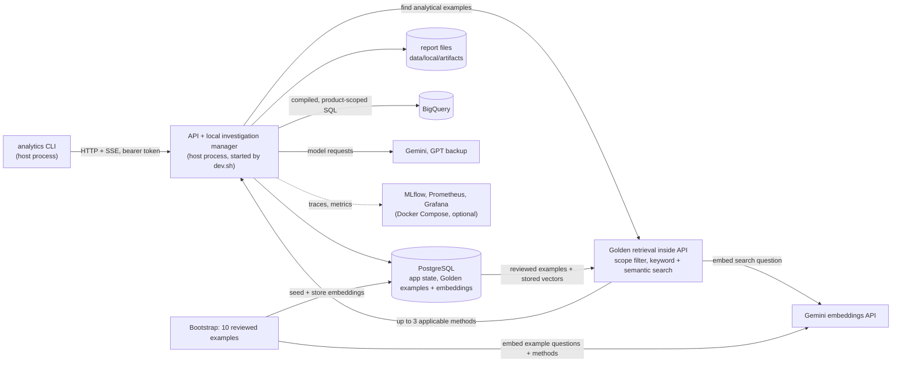

# Retail Analytics Agent

A conversational analytics assistant for retail executives. You ask a business question in a terminal chat; one adaptive agent investigates it with guarded BigQuery queries limited to the brands and products you are entitled to, asks when the question is ambiguous, answers with the definitions and evidence it used, and can save the result as a report with recommended actions. Deleting a report always needs your explicit confirmation.

A short exchange: the questions and released answers of a recorded live run against the public `thelook_ecommerce` dataset, as stored, with the progress lines left out and the answers abbreviated (figures depend on the data when you ask):

```text
Q: What's the latest revenue of September?
A: For the most recent September in the data (September 1, 2026 through September 30, 2026),
   revenue was 141,190.75 (source currency, not verified) [evd_8b11…]. This is measured using
   the standard definition of completed item sales (items with status 'Complete' across your
   permitted products, dated by UTC order date).
Q: And August?
A: For August 2026 (...), revenue was 110,644.81 (source currency, not verified) [evd_7adf…].
```

The model wrote the SQL; the application compiled it against an approved logical schema, added the access filter, ran it under byte and time limits and stored the released rows as evidence (`evd_…`). The chat shows each cited evidence ID as a number (`[1]`) followed by a `SOURCES` list that describes the result (definition, period, when it was computed); the stored answer keeps the full ID. The full transcript, including the generated and executed SQL, is in [evaluation/real-model](evaluation/real-model/efficiency/results/transcripts/live-smoke.md).

## Quick start

**Prerequisites:** Git, Docker with Compose v2, and Python 3.12 (or [uv](https://docs.astral.sh/uv/)). Live analysis is the default and also needs a Google Cloud project for BigQuery query jobs with Application Default Credentials, and a Gemini API key; an OpenAI key is an optional backup. See [Google access setup](docs/google-access.md).

**1. Set up** (once; safe to rerun). Enter your Google Cloud project and Gemini key when prompted; existing values are preserved. Authenticate BigQuery first:

```sh
gcloud auth application-default login
./scripts/bootstrap.sh --interactive
```

> **Check your settings:** Review `.env` in the project root to verify the values entered during interactive setup.

**2. Start** the backend (Ctrl-C stops it):

```sh
./scripts/dev.sh
```

**3. Chat**, in a second terminal:

```sh
./scripts/local_cli.sh
```

The launcher issues a fresh local-admin token into `~/.analytics-token` (mode 0600) and runs `analytics chat`; options such as `--resume` are passed on to `chat`. It starts nothing, so the backend from step 2 must be running. The token lasts 60 minutes and is never printed; run the launcher again for a new one. Manual token steps (another identity, another token file) are in [local administration](docs/local-admin.md#tokens-by-hand).

You are the local administrator, `exec-local-admin`: bootstrap provisions it with the executive, editor, reviewer and admin roles and an explicit grant of every product in the dataset (an admin role alone grants no data).

Live mode and local execution are the defaults (`APP_MODE=live`, `EXECUTION_BACKEND=local`). Missing credentials or failed access checks stop setup with an actionable error. Existing `.env` values are preserved: if yours explicitly says `APP_MODE=fixture`, change it to `live` and rerun bootstrap. Fixture mode is an opt-in offline wiring check that returns a fixed response, not real analysis. Temporal is [opt-in](docs/development.md#temporal-execution-opt-in).

## Explore the traces and dashboards

Telemetry starts automatically with the default setup. Ask a question, then open:

| Tool | Local link | Login |
| --- | --- | --- |
| **MLflow — investigation traces** | **[Open traces](http://127.0.0.1:55500/#/experiments/0/traces)** | No login required |
| **Grafana — Agent overview** | **[Open agent dashboard](http://127.0.0.1:53000/d/ra-agent-overview)** | `admin` / `admin` |
| **Grafana — Local telemetry overview** | **[Open telemetry dashboard](http://127.0.0.1:53000/d/ra-local-telemetry)** | `admin` / `admin` |

**Grafana loads both dashboards and the Prometheus data source automatically**—no manual import is needed. Metrics appear as you use the assistant. The login above is the default unless you override `COMPOSE_GRAFANA_ADMIN_PASSWORD` or change it in Grafana.

In **MLflow**, open an investigation trace to inspect sanitized model inputs and outputs, model names, tool calls, SQL, token usage and estimated costs.

### Representative conversations (live mode)

Questions to try in `analytics chat`. The assistant's wording and figures depend on the model and the data, so only the shape of each exchange is shown.

1. **Ask, clarify, answer.** `you> How did revenue trend last quarter?` The assistant may ask a clarifying question (for example which period or revenue definition); answer it at the `answer>` prompt. A status line says what the run is doing (for example `Comparing revenue by category.`); the answer ends with the definitions and limitations used (`== DISCLOSURES ==`) and suggested next steps.
2. **Save and read a report.** `you> Save that as a report.` Then `/reports` lists your reports, `/report <id>` reads one with its evidence, and `/export <id> report.md` writes the Markdown.
3. **Delete, with your confirmation.** `you> Delete the report you just saved.` The assistant can only propose a deletion. The chat shows the server's record of the proposal; `/confirm <proposal-id>` asks you to type the exact phrase (for example `delete 1 report`). Anything else keeps the report. The model never confirms.

**While a run is working**, Ctrl-C only detaches the chat: the investigation keeps running in the backend, `/follow` re-attaches and `analytics chat --resume` reopens the conversation later. `/cancel` stops it. Stopping `dev.sh` (Ctrl-C in its terminal) ends any running investigation as *interrupted*; it is not resumed after a restart, so you send the request again. Details: [CLI guide](docs/cli.md).

**Costs and limits.** Query jobs run in your project; a project without billing uses the BigQuery sandbox. Each query is capped by `QUERY_MAX_BYTES` (1 GiB) and each investigation by `RUN_MAX_BYTES`, `RUN_MAX_QUERIES`, `RUN_MAX_PROVIDER_REQUESTS` and `RUN_MAX_TOKENS` (see `.env.example`). Each question has 120 seconds of active work (`RUN_ACTIVE_SECONDS`; waiting for your answer does not count) and a soft limit of USD 1 of estimated model spend (`RUN_MAX_MODEL_COST_USD`; an estimate from public prices, not a provider invoice); when either runs out the run stops and shows what it verified so far ([run budgets](docs/components.md#run-budgets-and-recovery)). Gemini and OpenAI rate limits and free allowances depend on your key and tier and change over time: check the providers' current pricing and rate-limit pages. This project does not promise any free usage.

## What runs on your machine



- **Live mode is the normal mode.** It analyzes real BigQuery data with real models. Fixture mode (`APP_MODE=fixture`) exists for automated tests and an offline wiring check; it returns a fixed response and does not analyze anything.
- **Investigations run inside the API process** (local execution, the default). Setup and `dev.sh` start PostgreSQL and, unless you pass `--no-telemetry`, the telemetry stack. They start no Temporal service. A bare `docker compose up` starts every service in `compose.yaml`, Temporal included, and containers left from an earlier Temporal setup keep running; neither changes how investigations execute. Durable execution on Temporal is an [opt-in mode](docs/development.md#temporal-execution-opt-in).
- **Golden Knowledge guides the method.** Bootstrap seeds ten reviewed analytical examples and verifies their stored embeddings. Retrieval combines keyword and semantic matches, checks access and compatibility, and returns applicable methods and SQL—not historical figures to reuse as current results. See [retrieval design](docs/components.md#golden-retrieval) and [measured evaluation](evaluation/retrieval/README.md).
- **The local administrator is provisioned explicitly.** Bootstrap creates one identity with every role and an explicit grant of every product; the admin role alone grants no data. Two demo brand managers, each assigned two brands, show brand-based access. See [local administration](docs/local-admin.md) and [brand-based access](docs/brand-access.md).

## Architecture

The [architecture overview](docs/architecture/README.md) has the local and production deployment diagrams, the agent loop and its skills, data flow and trust boundaries, the technology choices with their trade-offs, and how each requirement is met. The production design is not provisioned; its cloud services are proposals.

Framework rationale and my experience with the tools are in [framework choice and author experience](docs/architecture/technology-choices.md#framework-choice-and-author-experience).

## Project status

Working prototype for local use. Nothing is deployed.

- Real-model evaluation: [evaluation/real-model](evaluation/real-model/README.md) (measured; human review of the generated reports is pending).
- Security verification: [docs/security-verification.md](docs/security-verification.md).
- Recovery: [docs/recovery-walkthrough.md](docs/recovery-walkthrough.md) (tests pass; the hands-on CLI walkthrough has not been run yet).
- Deferred work and known limits: [known limitations](docs/architecture/known-limitations.md). Release audit: [release verification](docs/release/verification.md).

## Documentation

| Topic | Document |
| --- | --- |
| Architecture, diagrams, technology choices, requirements | [docs/architecture](docs/architecture/README.md) |
| Chat commands, Ctrl-C, resume, exit codes | [CLI guide](docs/cli.md) |
| Identities, demo users, publishing Golden examples and persona changes | [Local administration](docs/local-admin.md) |
| Brand assignments for managers | [Brand-based access](docs/brand-access.md) |
| BigQuery and Gemini credentials | [Google access](docs/google-access.md) |
| Models, time limits, fallback | [Model providers](docs/model-providers.md) |
| Local and Temporal execution, recovery, steering | [Investigation runtime](docs/investigation-runtime.md) |
| HTTP and SSE endpoints | [HTTP and SSE API](docs/http-api.md) |
| Traces, metrics, dashboards | [Observability](docs/observability.md) |
| Each backend component, its guarantees and limits | [How the components work](docs/components.md) |
| Development, checks, settings, bootstrap, evaluation runner | [Development and local operations](docs/development.md) |

## Development

Python 3.12. `./scripts/check.sh` runs lint, formatting, strict typing and the test suite (architecture checks included); it must pass before each commit. Tests run offline; tests that need real credentials are marked `live` and skip without them. Settings, entry points and the bootstrap step list are in [development and local operations](docs/development.md).

Do not commit credentials, raw query results or private conversation data.
