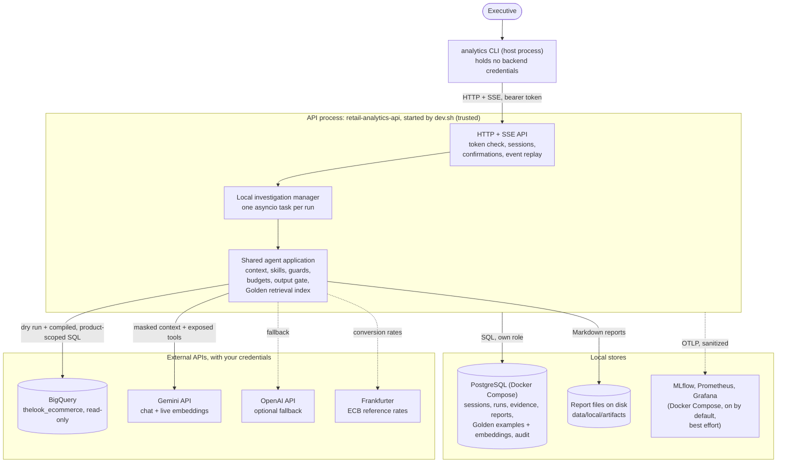
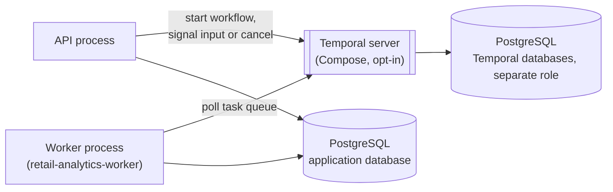

# Architecture: high-level design

This is the high-level design (HLD) of the Retail Analytics Agent. Executives
ask business questions in a CLI. One adaptive agent investigates them with
guarded BigQuery queries and reviewed analyst examples. It then answers or
writes a report with evidence and action items.

The design covers two deployments:

- **Local prototype (implemented).** A CLI, one API process that also runs
  the investigations, PostgreSQL and an optional local telemetry stack, on
  one machine. Temporal is an optional local mode.
- **Production deployment (designed, not provisioned).** The same
  application with a separate API service and investigation workers. The
  agreed direction is to start with the simpler execution backend (no
  durable replay, honest interruption handling) and adopt Temporal when
  measured recovery costs and workload justify it; estimated model spend
  and active time are bounded per question. Specific cloud services are
  candidates, and some deployment choices are still open. See
  [production deployment](production-deployment.md).

## How to read the claims

Every statement in these documents has one of these statuses:

| Label | Meaning |
| --- | --- |
| **Implemented** | The code exists in this repository and automated tests cover it. Tests use controlled fixtures unless the text says otherwise. |
| **Measured** | A dated result exists in the repository, with its method and limits (for example the [retrieval benchmark](../../evaluation/retrieval/README.md)). |
| **Pending** | The evaluation is planned or running, and its results are not published yet. No outcome is claimed. |
| **Proposed** | Design for production. Nothing is provisioned or verified. |
| **Deferred** | Agreed as future work. It is not implemented and does not count as a satisfied requirement. |

## Local deployment (implemented)

Solid arrows are the main request path; dotted arrows are optional or best
effort. The trust boundary is the API process: the CLI and the model are
outside it. The model never receives credentials, identity, entitlements or
the right to execute SQL; it proposes tool calls, and application code
decides what each call may do. Golden example embeddings default to Gemini in live mode and the offline
hashing embedder in fixture mode. Live mode does not silently fall back to
hashing. In either mode the vectors are stored in PostgreSQL.

**Optional Temporal mode.** With `EXECUTION_BACKEND=temporal`, setup also
starts a Temporal server in Compose (with its own databases and role), and
`dev.sh` runs a separate worker process. The API then starts workflows
instead of local tasks; the agent application, guards and stores are the
same. This mode is not needed for the local demo.

The production proposal is on its own page:
[production deployment](production-deployment.md). The agent's decision
loop, tool exposure and limits are in [the agent loop](agent-loop.md).

## Core user flow

The main path is: ask, investigate or clarify, get a grounded answer, save and
read a report, then delete it with explicit confirmation.

1. **Ask.** The CLI sends the question with a bearer token. The API checks the
   token, maps it to an executive, and stores the message in PostgreSQL. It
   then starts a run, or steers the session's active run.
2. **Investigate.** Deterministic admission first declines clearly
   off-topic requests without a model call. The runner then starts the
   agent. Each model step gets context that is rebuilt under the executive's
   *current* authority: the request, the approved schema, recent
   conversation, usable evidence, preferences, the pinned persona and the
   remaining budget. The model sees the core analysis tools and a catalog
   of skills it can load for investigations, reports, preferences or
   currency conversion; see [the agent loop](agent-loop.md).
   `find_analysis_examples` (investigation skill) returns up to three
   applicable Golden examples, or none.
3. **Query.** The model writes SQL over a reviewed logical catalog. The SQL
   compiler rejects anything it cannot fully resolve, and any result that
   would show a customer demographic below group level. It then binds every
   relation to a projection filtered to the executive's products (explicit
   grants plus the products of assigned brands). BigQuery runs
   the compiled query under byte and time limits. The result boundary releases
   bounded rows, and the rows are stored as immutable evidence.
4. **Clarify (when needed).** The run waits for the user and makes no model
   calls while it waits. The CLI shows the question, and the answer resumes the
   run.
5. **Answer.** The output privacy gate checks the whole answer before it is
   released. Citations must point at evidence that the executive may use
   now; the CLI shows them as numbered sources. Progress events (written by
   the application, not the model) go to PostgreSQL first. SSE delivers
   them, and they can be replayed after a disconnect.
6. **Report.** `save_report` writes a Markdown artifact plus a versioned record
   that cites its evidence. Reads recheck ownership and product coverage.
7. **Delete.** The agent can only *propose* a deletion of exact report IDs
   that the user owns. The user confirms with `/confirm <proposal-id>` in the
   chat and types the exact phrase it asks for. One PostgreSQL transaction rechecks the proposal, soft-deletes the
   reports and writes the audit event.

[Data flow and trust boundaries](data-flow.md) has sequence diagrams for this
flow and for deletion.

## Component map

The production column follows the [production design](production-deployment.md):
the execution approach is agreed, the named cloud services are proposals,
and nothing is provisioned.

| Building block | Local prototype (implemented) | Production (agreed direction; services proposed) | Communication |
| --- | --- | --- | --- |
| Client | `analytics` CLI (Click, httpx) | Same CLI; a web client is a future extension | HTTPS JSON requests; SSE with `Last-Event-ID` replay |
| API | FastAPI + Uvicorn, one process | Cloud Run service, several instances | Receives CLI calls; writes PostgreSQL; schedules runs |
| Investigation execution | Local manager inside the API process (default) or Temporal worker (opt-in) | Initially the same simpler manager in one long-lived process (interrupted runs are replaced, not resumed); optionally Temporal workers on Cloud Run worker pools | Local: in-process asyncio tasks. Temporal: workers poll a task queue over gRPC and TLS |
| Durable execution | Temporal server in Docker Compose (opt-in only) | None at first; Temporal Cloud when measured recovery costs justify it | Workflow history, timers, signals, activity retries |
| Agent | Pydantic AI with a project adapter for the Gemini Interactions API and the OpenAI Responses model | Same | HTTPS to model providers |
| Application database | PostgreSQL 17 (Docker) | Cloud SQL for PostgreSQL | SQL over TLS, least-privilege roles |
| Golden retrieval | BM25 + exact cosine search in process; vectors stored in PostgreSQL | Same at small scale; pgvector when the corpus grows | Inside the backend |
| Analytical source | BigQuery public dataset `thelook_ecommerce` | Company-owned BigQuery dataset, optionally with row-level security as a second filter | BigQuery jobs API, dry run first |
| Report artifacts and Golden originals | Local directory (reports); Golden trios in PostgreSQL | Cloud Storage (adapter not built), with Golden metadata, text and embeddings indexed in PostgreSQL | Through the `BlobStore` port |
| Identity and access | Local HS256 JWTs (simulated); brand assignments and product grants in PostgreSQL | Company OIDC provider (JWKS), CLI device login; provider and assignment administration open | Bearer token on every request |
| Secrets | `.env` file, generated locally | Secret Manager with workload service identities | Read at startup |
| Telemetry | MLflow, Prometheus, Grafana in Compose | The company's Grafana if available, with a metrics backend; MLflow for agent traces (owner open) | OTLP/HTTP, best effort |
| Exchange rates | Frankfurter (ECB reference rates) | Same, or a company rate source behind the same port | HTTPS |

## Where to go next

| Topic | Document |
| --- | --- |
| Requests, data movement, storage and trust boundaries | [Data flow and trust boundaries](data-flow.md) |
| Production design: agreed direction, proposed services, model spend, Temporal adoption, open decisions | [Production deployment](production-deployment.md) |
| The agent loop, tool exposure and limits | [The agent loop](agent-loop.md) |
| Why these services, models and frameworks, with alternatives | [Technology choices](technology-choices.md) |
| How each of the eight requirements is met, with evidence and limits | [Requirements coverage](requirements.md) |
| Adding charts, e-mail delivery, web search and other capabilities | [Extension contracts](extensions.md) |
| What is deferred or limited | [Known limitations](known-limitations.md) |
| Runtime internals | [Investigation runtime](../investigation-runtime.md) |
| Traces, metrics and dashboards | [Observability](../observability.md) |
| Model routing, timeouts and fallback | [Model providers](../model-providers.md) |
| API and CLI | [HTTP and SSE API](../http-api.md), [CLI](../cli.md) |
| Each backend component in detail | [How the components work](../components.md) |
| Brand assignments and their lifecycle | [Brand-based access](../brand-access.md) |
