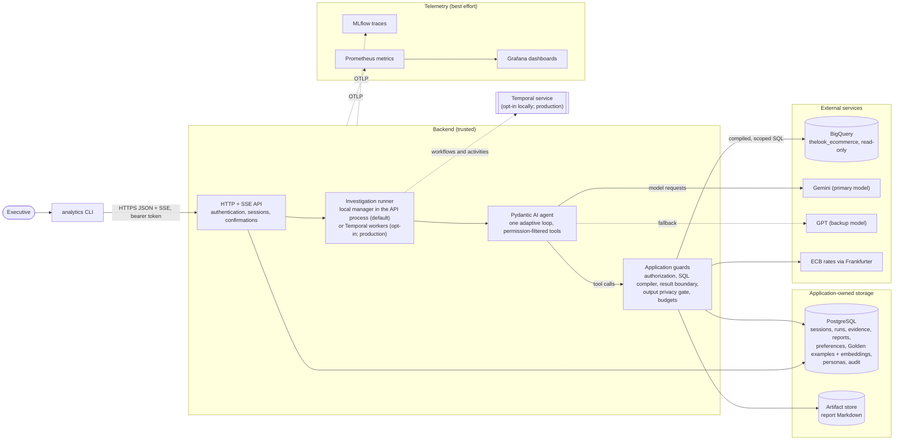

# Architecture: high-level design

This is the high-level design (HLD) of the Retail Analytics Agent. Executives
ask business questions in a CLI. One adaptive agent investigates them with
guarded BigQuery queries and reviewed analyst examples. It then answers or
writes a report with evidence and action items.

The design covers two deployments:

- **Local prototype (implemented).** A CLI, one API process, PostgreSQL and an
  optional local telemetry stack, on one machine.
- **Production reference deployment (proposed, not provisioned).** The same
  application on Google Cloud, with Temporal as the durable execution service.
  See [production deployment](production-deployment.md).

## How to read the claims

Every statement in these documents has one of these statuses:

| Label | Meaning |
| --- | --- |
| **Implemented** | The code exists in this repository and automated tests cover it. Tests use controlled fixtures unless the text says otherwise. |
| **Measured** | A dated result exists in the repository, with its method and limits (for example the [retrieval benchmark](../../evaluation/retrieval/README.md)). |
| **Pending** | The evaluation is planned or running, and its results are not published yet. No outcome is claimed. |
| **Proposed** | Design for production. Nothing is provisioned or verified. |
| **Deferred** | Agreed as future work. It is not implemented and does not count as a satisfied requirement. |

## Architecture diagram

Solid arrows are the main request path. Dotted arrows are optional or
best-effort. The model never receives credentials, identity, product
entitlements or raw SQL execution rights. It calls tools, and application code
decides what each call may do.

## Core user flow

The main path is: ask, investigate or clarify, get a grounded answer, save and
read a report, then delete it with explicit confirmation.

1. **Ask.** The CLI sends the question with a bearer token. The API checks the
   token, maps it to an executive, and stores the message in PostgreSQL. It
   then starts a run, or steers the session's active run.
2. **Investigate.** The runner starts the agent. Each model step gets context
   that is rebuilt under the executive's *current* authority: the request,
   recent conversation, usable evidence, preferences and the pinned persona.
   The agent chooses tools from the same small catalog on every step. One of
   them, `find_analysis_examples`, returns up to three applicable Golden
   examples.
3. **Query.** The model writes SQL over a reviewed logical catalog. The SQL
   compiler rejects anything it cannot fully resolve. It then binds every
   relation to a product-filtered, privacy-preserving projection. BigQuery runs
   the compiled query under byte and time limits. The result boundary releases
   bounded rows, and the rows are stored as immutable evidence.
4. **Clarify (when needed).** The run waits for the user and makes no model
   calls while it waits. The CLI shows the question, and the answer resumes the
   run.
5. **Answer.** The output privacy gate checks every answer section before it is
   streamed. Citations must point at evidence that the executive may use now.
   Progress events go to PostgreSQL first. SSE delivers them, and they can be
   replayed after a disconnect.
6. **Report.** `save_report` writes a Markdown artifact plus a versioned record
   that cites its evidence. Reads recheck ownership and product coverage.
7. **Delete.** The agent can only *propose* a deletion of exact report IDs
   that the user owns. The user confirms with `confirm <proposal-id>` in the
   CLI. One PostgreSQL transaction rechecks the proposal, soft-deletes the
   reports and writes the audit event.

[Data flow and trust boundaries](data-flow.md) has sequence diagrams for this
flow and for deletion.

## Component map

| Building block | Local prototype (implemented) | Production (proposed) | Communication |
| --- | --- | --- | --- |
| Client | `analytics` CLI (Click, httpx) | Same CLI; a web client is a future extension | HTTPS JSON requests; SSE with `Last-Event-ID` replay |
| API | FastAPI + Uvicorn, one process | Cloud Run service, several instances | Receives CLI calls; writes PostgreSQL; schedules runs |
| Investigation execution | Local manager inside the API process (default) or Temporal worker (opt-in) | Temporal workers on GKE Autopilot, connected to Temporal Cloud | Temporal: gRPC over TLS. Local: in-process asyncio tasks |
| Durable execution | Temporal server in Docker Compose (opt-in only) | Temporal Cloud namespace | Workflow history, timers, signals, activity retries |
| Agent | Pydantic AI with a custom Gemini Interactions adapter and the OpenAI Responses model | Same | HTTPS to model providers |
| Application database | PostgreSQL 17 (Docker) | Cloud SQL for PostgreSQL, high availability, point-in-time recovery | SQL over TLS, least-privilege roles |
| Golden retrieval | BM25 + exact cosine search in process; vectors stored in PostgreSQL | Same at small scale; pgvector with an approximate index when the corpus grows | Inside the backend |
| Analytical source | BigQuery public dataset `thelook_ecommerce` | Company-owned copy or authorized dataset, with BigQuery row-level security as an extra layer | BigQuery jobs API, dry run first |
| Report artifacts | Local directory or Docker volume | Cloud Storage bucket with object versioning | Through the `BlobStore` port |
| Identity | Local HS256 JWTs (simulated) | Company OIDC identity provider (JWKS), CLI device login | Bearer token on every request |
| Secrets | `.env` file, generated locally | Secret Manager, workload identity | Read at startup |
| Telemetry | MLflow, Prometheus, Grafana in Compose | MLflow on Cloud Run (Cloud SQL + Cloud Storage); Managed Service for Prometheus; Grafana | OTLP/HTTP, best effort |
| Exchange rates | Frankfurter (ECB reference rates) | Same, or a company rate source behind the same port | HTTPS |

## Where to go next

| Topic | Document |
| --- | --- |
| Requests, data movement, storage and trust boundaries | [Data flow and trust boundaries](data-flow.md) |
| Production services, Temporal topology, scaling, backup and recovery | [Production deployment](production-deployment.md) |
| Why these clouds, models and frameworks, and why Temporal | [Technology choices](technology-choices.md) |
| How each of the eight requirements is met, with evidence and limits | [Requirements coverage](requirements.md) |
| Adding charts, e-mail delivery, web search and other capabilities | [Extension contracts](extensions.md) |
| What is deferred or limited | [Known limitations](known-limitations.md) |
| Runtime internals | [Investigation runtime](../investigation-runtime.md) |
| Traces, metrics and dashboards | [Observability](../observability.md) |
| Model routing, timeouts and fallback | [Model providers](../model-providers.md) |
| API and CLI | [HTTP and SSE API](../http-api.md), [CLI](../cli.md) |
