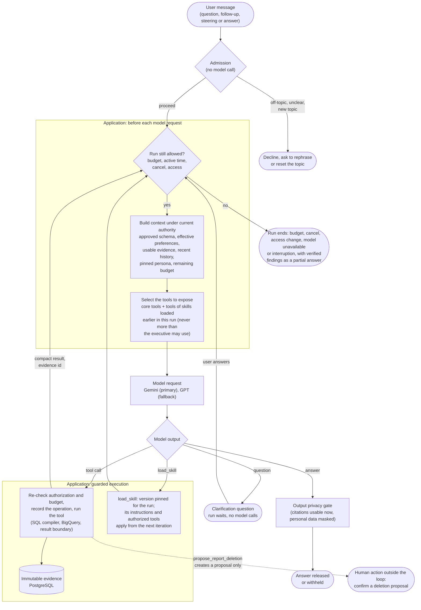
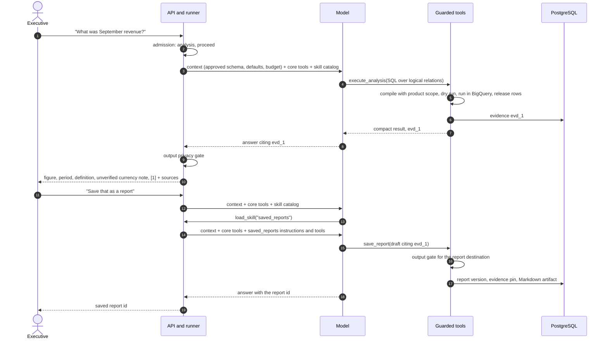

# The agent loop

One adaptive agent handles every request. It is a loop: the application
builds the context, the model chooses what to do next, the application
checks and executes that choice, and the result feeds the next iteration.
There is no fixed sequence of stages. A figure question can finish after one
query; an open "why" question can take several queries; a request to save a
report loads the saved-reports skill. The loop is the same for the local manager and
for Temporal (see [investigation runtime](../investigation-runtime.md)).

## One iteration

How to read it:

- **Admission** is deterministic code. Clearly off-topic requests, an
  unclear first message and a topic reset are handled before any model
  call. Misspelled analytical words are tolerated. Admission authorizes
  nothing; every later check still applies.
- **Context is rebuilt before every model request** under the executive's
  *current* entitlements. It includes a compact approved-schema block, so
  ordinary questions need no discovery calls. Evidence or history that
  current access no longer allows is left out, and earlier answers that used
  it are withheld from the model.
- **The model's choice is a proposal.** Tool arguments, SQL and drafts are
  untrusted. Tool inputs cannot carry identity, entitlements, budgets or
  approval; the application resolves those itself on every attempt.
- **Evidence, not rows, flows back.** Query results are stored as immutable
  evidence; the model gets a compact result and an evidence ID it must cite.
- **Steering** (a new message while the run works) is applied at the next
  iteration boundary, not in the middle of a tool call. If the run ends
  before another iteration, the steering is marked not applied and the
  closing message quotes it, so an answer never pretends to include it.
- **Progress** is written by the application, not the model: each tool start
  carries a fixed label (for queries, a template chosen from the fields the
  compiler verified, such as "Comparing revenue by category."). The CLI shows
  one status line, at most about once a second, with elapsed time on long
  steps. The answer itself is shown only after the whole answer has passed
  the output gate; model tokens are never streamed to the user.
- **Partial answers.** When a run stops early, the user gets the verified
  findings that match the question and the reason it stopped, never a guess.

## Core tools and skills

The model never sees more tools than the executive may use. Within that
authorized set, every run starts with the core tools and a short catalog of
**skills**: bundled, versioned instructions that come with a few specialized
tools. A skill is not another agent; it is guidance plus tools for the same
loop, and it grants no permission.

| Exposed | Tools | Guidance |
| --- | --- | --- |
| Always (core) | `list_relations`, `describe_relation`, `execute_analysis`, `fetch_evidence`, `load_skill` | Base rules: answer what was asked, stop when cited evidence suffices, customer demographics only at group level, no figure for a brand outside the executive's scope |
| Skill `investigation` | `find_analysis_examples` | Multi-step comparisons and "why" questions: hypotheses labelled as such, contributors kept apart from causes |
| Skill `saved_reports` | `save_report`, `read_report`, `list_reports`, `search_reports`, `export_report`, `propose_report_deletion` | Saving, reading and exporting reports; deletion can only be proposed |
| Skill `preferences` | `inspect_preferences`, `remember_preference`, `forget_preference`, `confirm_preference`, `decline_preference` | Explicit preferences saved; inferred ones only after the user confirms |
| Skill `currency_conversion` | `convert_currency` | Convert only on request; an unverified source currency stays unverified |

- **Loading.** The model calls `load_skill(name)` with one of the listed
  names. The activation is recorded with the skill's current version, and the
  skill's instructions and authorized tools appear at the **next** iteration.
  A specialized tool called in the same response as the load, or one only
  seen in earlier history, is refused with a message naming the skill.
- **Scope.** Loaded skills stay for the rest of the run, including retries
  and restarts, and are pinned to the version loaded, so a new release does
  not change a running investigation. A new run, or a topic reset, starts
  with core tools again. A mixed request can load several skills; a question
  that matches none is answered with the core tools.
- **Authority.** Skill definitions come only from bundled code. User text,
  the persona, Golden examples and tool results cannot define or widen a
  skill. Exposure and execution are checked against current permissions on
  every step, and guidance for tools the executive cannot use is left out.
- The selection is a pure function of the authorized tools and the run's
  recorded activations, so both execution backends compute the same set.

## Limits and boundaries

| Boundary | Enforced by |
| --- | --- |
| 120 seconds of active work (clarification waits excluded) | Hard deadline: in-flight model and tool waits are cut off, running BigQuery jobs get one bounded cancellation request, and the run ends with its verified findings |
| About USD 1 of estimated model spend (soft) | Each settled model request is priced and charged to the run; once the limit is reached no further request starts (the request in flight can overshoot) |
| 20 provider requests, 100k tokens, 10 queries, 1 GiB per query, 5 GiB per run | Persisted run budget, checked before each model request and each query; the remaining budget is shown to the model |
| 2 reformulations per failed query, 3 transient attempts | Run budget and recovery classification |
| Cancel | Explicit user action; stops new work and reconciles running BigQuery jobs |
| Access change during a run | Entitlements re-read on every attempt; the run stops and nothing derived from lost access is released |
| A brand outside the executive's scope | A query that filters only on such brands is refused before BigQuery; the model is told the brand is outside the permitted scope, never that its revenue is zero |
| Destructive actions | The model can only propose a deletion of exact report IDs. Confirmation is a separate authenticated user action in the CLI or API; the model has no confirm tool |
| Personal data and citations | Output privacy gate on every answer, report, memory entry and progress text |

## A concrete conversation

Deletion follows the same pattern up to the proposal; the
[data flow](data-flow.md#destructive-operation-report-deletion) page shows the
confirmation, which happens outside the loop.
