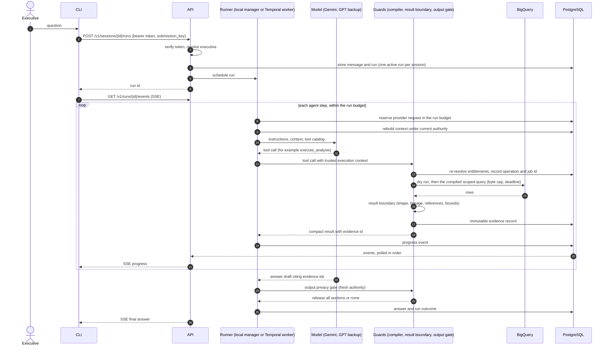
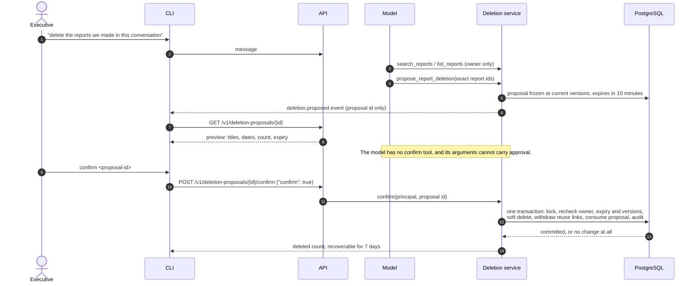
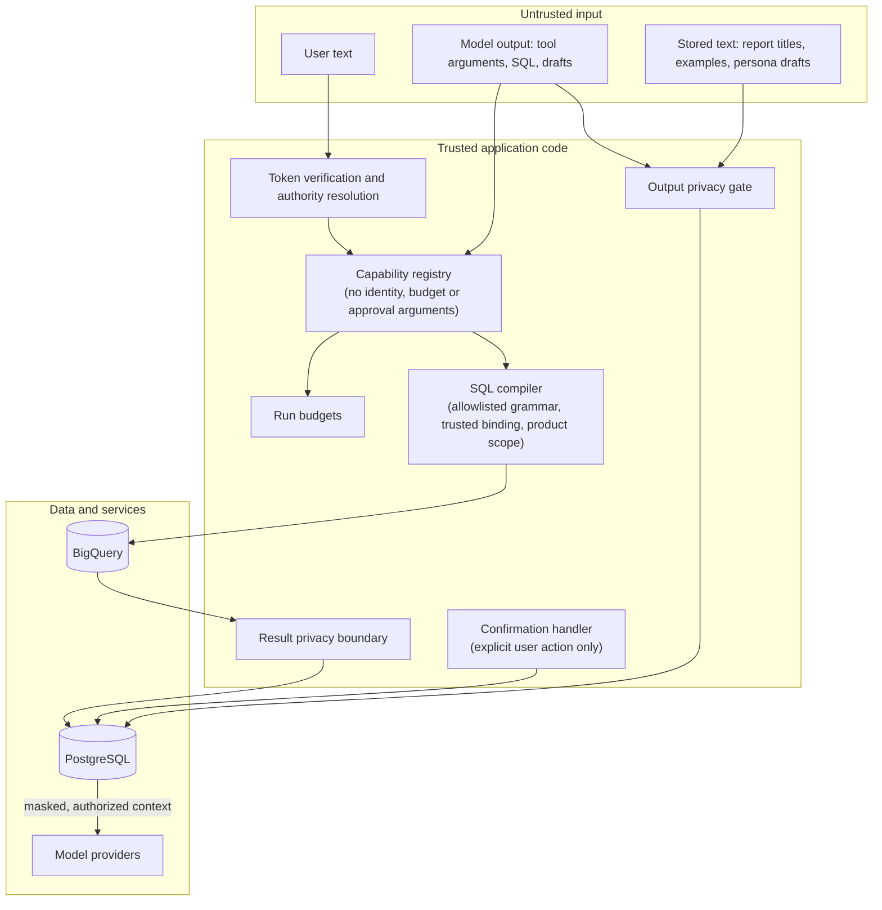

# Data flow and trust boundaries

This page shows how a request moves through the system, where each kind of
data is stored, and which component is trusted with what. Unless a line says
"proposed", it describes the implemented local prototype.

## Investigation: question to grounded answer

Notes:

- The agent can stop for a clarification at any step. The question is stored,
  the active-time clock pauses, and no model call is made until the user
  answers through `POST /v1/runs/{id}/answers`.
- With Temporal, the model call and each tool call are activities. Their
  inputs and results are evidence references and drafts, not result rows.
  Context is rebuilt inside the activity. With the local manager, the same
  steps run as asyncio tasks in the API process.
- A disconnect does not cancel the run. `Last-Event-ID` replays the events
  from PostgreSQL.

## Destructive operation: report deletion

Reports created after the proposal are never included. If any proposed report
changed, the whole proposal is stale and nothing is deleted.

## Storage map

| Data | Where (local) | Where (production, proposed) | Retention |
| --- | --- | --- | --- |
| Executives, roles, product entitlements, authorization version | PostgreSQL | Cloud SQL | Until changed; every change is audited |
| Sessions, messages, runs, ordered progress events, clarification inputs | PostgreSQL | Cloud SQL | 7 days after the later of last interaction and run completion |
| Operations and BigQuery job references | PostgreSQL | Cloud SQL | With the investigation. Unresolved operations are kept and flagged for manual resolution |
| Evidence (bounded released rows and provenance, JSONB) | PostgreSQL | Cloud SQL | With the investigation, or while a saved report pins it |
| Run budgets and charges | PostgreSQL | Cloud SQL | With the investigation |
| Saved report metadata, versions, evidence links, required product scope | PostgreSQL | Cloud SQL | Until deleted; soft-deleted reports are restorable for 7 days, then purged |
| Report bodies (Markdown) | Artifact directory or volume | Cloud Storage | Same as the report |
| Deletion proposals | PostgreSQL | Cloud SQL | Expire after 10 minutes |
| Preferences (explicit, confirmed inferred) | PostgreSQL | Cloud SQL | Until changed or forgotten |
| Golden examples, review history, provenance, embeddings | PostgreSQL | Cloud SQL (pgvector when needed) | Independent lifecycle: retire, suspend, erase |
| Persona versions, publications, run pins | PostgreSQL | Cloud SQL | Version history kept |
| Audit events (identifiers, versions, counts; never content) | PostgreSQL | Cloud SQL | 90 days by default (configurable) |
| Temporal workflow history (opt-in locally) | Separate PostgreSQL database | Temporal Cloud | 7 days after a workflow closes |
| Traces (sanitized) | MLflow | MLflow (Cloud SQL + Cloud Storage) | Backend defaults; no project policy yet |
| Metrics | Prometheus | Managed Service for Prometheus | Backend defaults |
| Retail transactions | BigQuery public dataset (read-only) | Company-owned BigQuery dataset | Not managed by this application |

Cleanup runs as a bounded, idempotent maintenance command
(`retail-analytics-maintenance cleanup`), started by an external scheduler. It
deletes database rows and artifact files only. Backups, snapshots and
write-ahead logs need their own retention policy before full physical erasure
can be claimed.

## Trust boundaries

What each boundary enforces:

| Boundary | Rule | Status |
| --- | --- | --- |
| Identity | A bearer token is verified on every request. Identity never comes from a request body, and tools never receive identity or entitlements as arguments. | Implemented (local HS256; production IdP proposed) |
| Authority | Entitlements and permissions are reloaded on every attempt, including inside retried activities. An empty product scope means no data. | Implemented |
| SQL | The model writes SQL over logical relations only. The compiler rejects anything it cannot resolve, and adds the product filter at every physical read before aggregation. | Implemented |
| Privacy | Direct identifiers never reach the model. Customers, orders and items appear only as per-executive opaque references, and ages only as bands. Results are checked again before release. | Implemented |
| Output | Each answer, report, memory entry and progress text passes the output gate. Citations must be usable now. | Implemented |
| Destructive actions | The model can propose a deletion. Only an authenticated user action can confirm it. | Implemented |
| Model providers | Only masked, authorized context leaves the backend. Requests send `store: false`. | Implemented. The free tier of the Gemini API may use submitted content to improve Google products, so production needs a paid tier or an equivalent agreement (see [production deployment](production-deployment.md)) |
| Telemetry | Attributes are allowlisted and redacted. Prompts, SQL and rows are never exported. | Implemented |

The privacy policy is pseudonymization, not anonymization. Demographic
combinations (country, state, age band) are allowed and can still single
people out. Detectors for names in free text are defense in depth, not proof;
see [known limitations](known-limitations.md).
