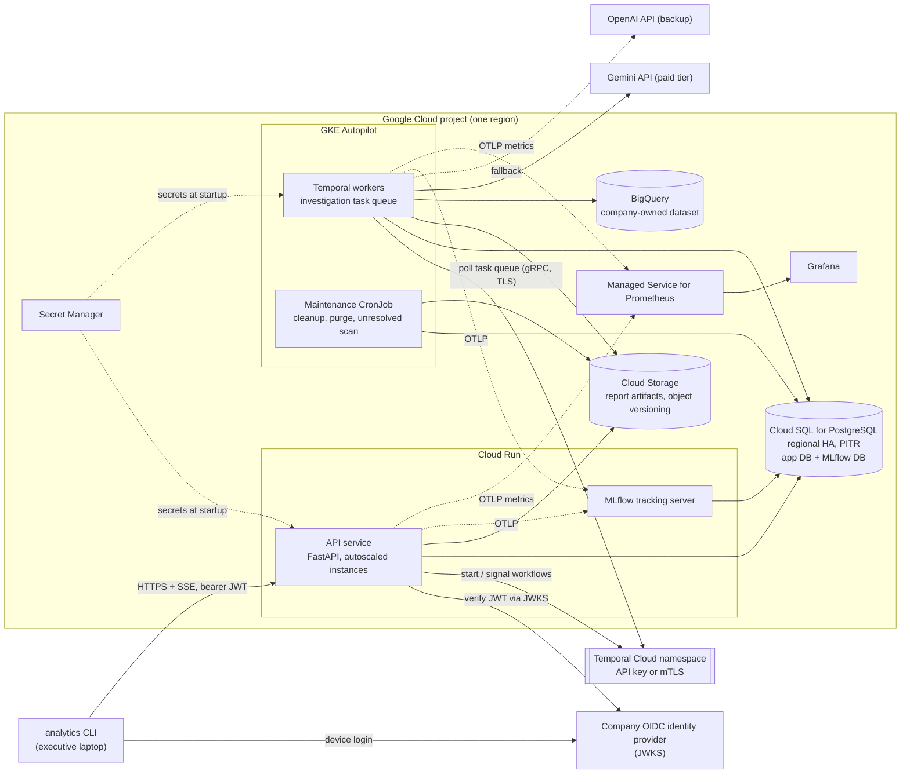
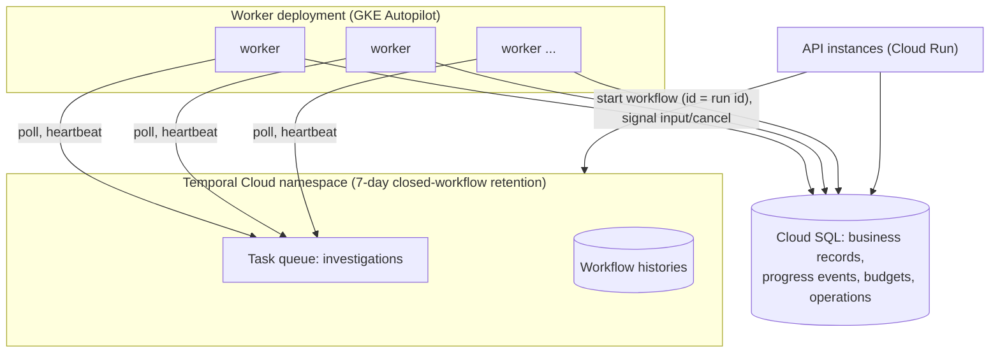

# Production reference deployment

**Status: proposed.** Nothing on this page is provisioned, deployed or tested.
The implemented target is the local prototype. This page names the services a
production deployment would use and gives the reason for each. Vendor facts
link to official documentation, checked on 2026-10-09. Recheck them before
provisioning.

Google Cloud is the reference platform because the analytical source is
BigQuery and the primary model is Gemini. The application code depends on
narrow ports (database, blob store, token verifier, warehouse jobs, model
chain), not on the hosting platform. Another cloud would replace adapters and
infrastructure, not application rules.

## Topology

## Services and reasons

| Building block | Proposed service | Why |
| --- | --- | --- |
| API | [Cloud Run](https://docs.cloud.google.com/run/docs/triggering/https-request) service | The API is stateless: all state lives in PostgreSQL and Temporal. Cloud Run streams HTTP responses without extra configuration, which SSE needs. The request timeout can be raised to [60 minutes](https://docs.cloud.google.com/run/docs/configuring/request-timeout). An SSE stream that ends at the timeout is not an error: the CLI reconnects with `Last-Event-ID`, and events replay from PostgreSQL. |
| Investigation workers | Temporal workers on [GKE Autopilot](https://docs.cloud.google.com/kubernetes-engine/docs/concepts/autopilot-overview) | Workers are long-running pollers, not request handlers, so a request-scaled platform is a poor fit. Autopilot means Google manages "nodes, scaling, security". Workers scale on task-queue backlog and are deployed separately from the API. |
| Durable execution | [Temporal Cloud](https://docs.temporal.io/cloud/namespaces) | Managed history, timers, signals and retries, with no Temporal cluster to run. Namespaces authenticate with API keys or mTLS. Retention can be 1 to 90 days, and the application uses 7 days for closed workflows. |
| Application database | [Cloud SQL for PostgreSQL](https://docs.cloud.google.com/sql/docs/postgres/high-availability) with high availability | The application already uses PostgreSQL transactions, row locks and advisory locks for reports, deletion, budgets and evidence. A regional HA instance keeps a standby in another zone with synchronous replication; failover takes about a minute. [Point-in-time recovery](https://docs.cloud.google.com/sql/docs/postgres/backup-recovery/pitr) restores to a chosen moment. |
| Vector search | [pgvector](https://github.com/pgvector/pgvector) on the same Cloud SQL instance, when needed | Cloud SQL [supports pgvector](https://docs.cloud.google.com/sql/docs/postgres/extensions). See "Golden retrieval at scale" below. |
| Report artifacts | [Cloud Storage](https://docs.cloud.google.com/storage/docs/object-versioning) | A second implementation of the existing `BlobStore` port. Object versioning keeps deleted objects as noncurrent versions, as protection against operator mistakes. Purge must then also remove noncurrent versions within the erasure policy. |
| Analytical source | BigQuery, company-owned dataset | Production data is the company's own, not the public sample. The application's SQL compiler stays the enforcement boundary. [Row-level security](https://docs.cloud.google.com/bigquery/docs/row-level-security-intro) on a company-owned table can add a second, independent product filter. It cannot be applied to the public dataset, which this project does not own. |
| Identity | Company OIDC identity provider | A verifier that uses the provider's published keys (JWKS) replaces the local HS256 verifier behind the existing `TokenVerifier` port. The CLI obtains tokens with the OAuth 2.0 device authorization grant ([RFC 8628](https://www.rfc-editor.org/rfc/rfc8628)). Roles and product entitlements stay server-side and are synchronized from the directory. No provider has been chosen. |
| Secrets | [Secret Manager](https://docs.cloud.google.com/secret-manager/docs/overview) | Holds model API keys, the customer-reference master key and the Temporal credential. It offers versions and fine-grained IAM. Workloads read secrets with their own service identity. No secret goes in images or environment files. |
| Metrics | [Managed Service for Prometheus](https://docs.cloud.google.com/stackdriver/docs/managed-prometheus) + Grafana | Accepts OpenTelemetry metrics and PromQL. Existing Grafana dashboards keep working, so the provisioned "Agent overview" dashboard can be reused. |
| Traces | [MLflow tracking server](https://mlflow.org/docs/latest/self-hosting/architecture/tracking-server/) on Cloud Run | The same trace store as locally. MLflow recommends PostgreSQL or MySQL as the backend store in production, so it would get its own database and role on Cloud SQL. Access is restricted to operators. |
| Models | Gemini API on a paid tier; OpenAI as backup | Under the [Gemini API terms](https://ai.google.dev/gemini-api/terms), Google may use content sent to unpaid services to improve its products, and human reviewers may read it. Paid services do not use prompts or responses for that. The local prototype runs on a free-tier key, so production must use a paid tier or an equivalent agreement. Before production, also check that the selected model and the Interactions API are available under the chosen terms and region. |

## Temporal production topology

- **Separation of authority.** Temporal is authoritative for scheduling and
  recovery. PostgreSQL is authoritative for business records, the
  progress-event read model and run budgets. Workflow IDs reject duplicate
  starts. Operation IDs stay stable across activity retries. Inputs commit
  to PostgreSQL before the workflow is signalled, and a dispatcher re-sends
  intents that were not delivered. All of this is implemented and tested
  against a local Temporal server.
- **Crash recovery.** If a worker dies, Temporal reschedules the activity on
  another worker. Effects are made idempotent by the application: BigQuery
  jobs are looked up by their recorded ID before any resubmission, and
  report saves use idempotency keys. The opt-in local Temporal mode runs a
  test that kills a worker after an external effect commits and checks that
  the effect happens once.
- **Payload privacy.** Activities pass evidence IDs and drafts, not result
  rows. Model messages, tool arguments and drafts can still appear in
  workflow history. Production should add a
  [payload codec](https://docs.temporal.io/payload-codec) that encrypts
  payloads before they reach Temporal Cloud, with keys in the company's key
  management. **Proposed, not implemented.**
- **Deployments.** Activity, workflow and error type names are recorded in
  histories and must stay stable. Workflow code changes roll out with
  [Worker Versioning](https://docs.temporal.io/production-deployment/worker-deployments/worker-versioning),
  so running investigations finish on the code that started them. The
  Docker test suite already replays workflow histories to check determinism;
  a release pipeline would also replay histories recorded from the previous
  version (proposed).
- **Scaling.** Concurrency per worker is bounded. Model calls dominate run
  time, so worker count follows provider rate limits and run budgets, not
  CPU.

## Why Temporal, and the simpler alternative

The requirements ask for investigations that continue when the CLI
disconnects, wait for clarification without polling the model, survive
process crashes without duplicate BigQuery jobs or double deletions, and
resume. Temporal provides durable history, timers, signals and activity
retries for this, so the project does not build its own checkpoint and
recovery engine. The costs are real: one more service, deterministic workflow
code, history growth and versioning discipline.

A simpler loop could satisfy the minimum prototype. A single process running
the agent loop over PostgreSQL meets every mandatory prototype control:
safety, confirmation, bounded error handling and observability. That is why
**local execution is the default** in this repository. Investigations run as
tasks inside the API process, on the same application steps, guards and
budgets, with no Temporal server. Temporal stays available as an opt-in mode
and is the production design.

### Local mode limits (implemented, accepted for the local demo)

| Limit | Production handling |
| --- | --- |
| Single process, best effort. A run survives CLI disconnects but not the API process. Graceful shutdown marks running investigations as interrupted. After a crash they are marked interrupted at the **next** start. Nothing is replayed or resumed; the user sends a new request. | Temporal resumes the workflow on another worker. |
| The single-manager guarantee is a PostgreSQL advisory lock tied to one database connection. If that connection drops, the lock is released silently and a second manager could start. | Temporal coordinates server-side with task queues, activity timeouts and heartbeats, and supports many workers. A production deployment without Temporal would need real leases or leader election, which is not built. |
| Discarding a queued request and writing its user notice are two separate writes. A failure between them can leave the request discarded without the explanation. It stays in history and is never executed. | Not applicable with Temporal, which promotes queued requests in order. |
| A failing step is not retried locally; the run stops with its verified findings. | Temporal retries activities within the run budget. |

Runs never move between backends. The API refuses to start while the other
backend still has active runs.

## Golden retrieval at scale

**Implemented:** BM25 and exact cosine similarity run in process over a small
corpus. Vectors are stored in PostgreSQL, keyed by content digest, model and
dimensions, so restarts make no embedding calls. Authorization and
applicability filters run *before* scoring. pgvector is not used: the pinned
local PostgreSQL image does not include it, and exact search over tens of
examples is cheap.

**Proposed path** when the corpus grows to thousands of examples or memory
per worker becomes a concern:

1. Enable pgvector on Cloud SQL and store vectors in a `vector` column next
   to the existing embedding rows.
2. Keep the eligibility filter (product scope, schema and metric versions,
   review status) in the same SQL query as the similarity search, so
   ineligible examples are never candidates.
3. Start with exact search. pgvector does exact nearest-neighbour search by
   default, with perfect recall. Add an HNSW index only when latency
   requires it. An approximate index can change results, so rerun the
   retrieval benchmark and compare recall against exact search before
   switching. Filtered approximate search can also return fewer rows than
   requested.
4. Keyword search can move to PostgreSQL full-text search. Fusion
   (weighted reciprocal rank) and delivery rechecks stay in application code.

## Security and network (proposed)

- Cloud Run ingress for the API only; the database, workers and MLflow are
  private. Grafana and MLflow sit behind the company identity provider.
- One service identity per workload with least privilege. Only workers get
  BigQuery job access; the API gets none. Workers and the API both get the
  Cloud SQL client role. The maintenance job gets storage delete rights only
  on the artifact bucket.
- A separate database role per component: application, MLflow, and
  migrations. Model-generated SQL never runs against PostgreSQL.
- BigQuery jobs keep the compiled `maximum_bytes_billed`. Project-level
  custom quotas add a daily ceiling.
- The customer-reference master key is long-lived. Rotating it retires every
  existing customer reference, so rotation is a planned event.

## Backup, retention and failure recovery

| Concern | Proposed handling |
| --- | --- |
| Database loss or corruption | Cloud SQL automated backups and point-in-time recovery; regional HA for zone failure. Recovery objectives (RPO/RTO) are not yet agreed. |
| Artifact loss | Object versioning; bucket in the same region as the database. A restore must keep artifact metadata and blobs consistent. The existing `reconcile` maintenance reports metadata whose file is missing. |
| Temporal history | Temporal Cloud retention of 7 days for closed workflows. Business records do not depend on it. |
| Retention jobs | The existing maintenance command runs as a Kubernetes CronJob. It is idempotent and bounded, so overlapping runs are safe. |
| Erasure | Purge deletes rows and artifact files. Backups, PITR logs and noncurrent object versions keep copies until they expire. Erasure is complete only after the longest backup retention, so that policy must be set and published. |
| Provider outage | Gemini to GPT fallback with a cooldown (implemented). If both providers fail, the run stops with verified findings. |
| BigQuery outage or timeout | Deadline, cancellation, then reconciliation by job ID (implemented). Schema discovery serves the last validated snapshot for up to 24 hours (implemented). |
| Telemetry outage | Exports are dropped and counted; requests are unaffected (implemented). Audit records are in PostgreSQL transactions and do not depend on telemetry. |
| Region failure | Not designed. A single region is assumed; multi-region would need Cloud SQL cross-region replicas and a Temporal Cloud high-availability namespace. |

## Not provisioned and not verified

No cloud resource was created for production. There is no infrastructure
code, no load test, no availability target, no alert rules, no penetration
test and no production identity provider. Before calling this deployment
production-ready, it needs infrastructure as code, a staging environment, the
security and recovery tests rerun on it, and agreed service targets.
