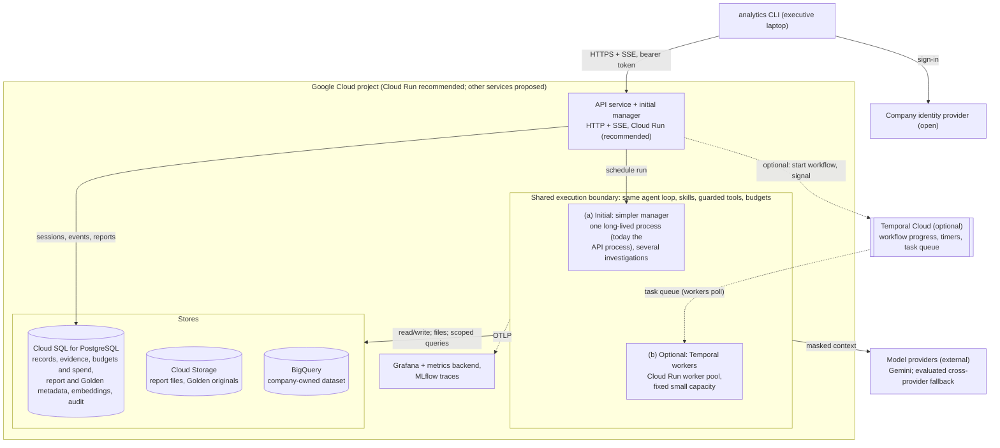
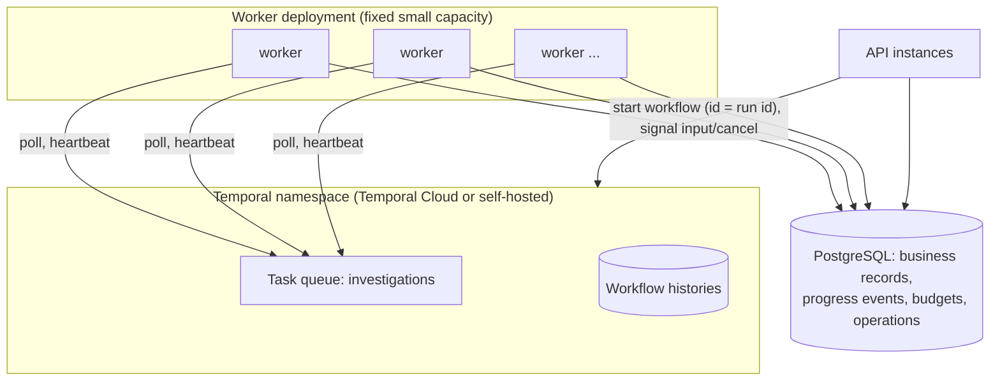

# Production deployment

**Status: designed, not provisioned.** Nothing on this page is deployed or
tested in a cloud. The page separates four kinds of statement:

- **Agreed direction**: decisions about how production should work, which
  the documentation and the code already follow.
- **Recommended**: a service selected for the design, but not provisioned.
- **Proposed**: a service candidate still awaiting a decision, with its
  alternative. No service has been purchased.
- **Open**: choices that still need information (listed at the end).

Vendor facts link to official documentation read on 2026-10-09; recheck them
before any provisioning. The application depends on narrow ports (database,
blob store, token verifier, warehouse jobs, model chain, execution
scheduler), so changing a service replaces an adapter or infrastructure,
not application rules.

## Requirements and measurements

**Workload (design input).** One retail company with tens to a few hundred
executives: about 100 active managers a day, about 1,000 questions and 100
saved reports a day, only a few investigations at the same time, and about
one million new warehouse rows a day. Targets: 10 to 30 seconds for a simple
answer, one to two minutes for a report. No peak-load figure, availability
target or recovery objective has been set.

**Access.** Managers may analyze only their assigned brands and the orders
and customers related to those brands' items; the CEO sees every brand
through an explicit grant. Customer demographics are available only as
group-level aggregates. Both rules are implemented in the prototype
([brand-based access](../brand-access.md), [privacy](data-flow.md#trust-boundaries)).

**Cost.** About USD 1 per question is treated as configurable *estimated
model spend*, summed over every model request of the question (retries and
fallback included). BigQuery, storage and infrastructure costs are separate.
This is a design assumption about what the target covers.

**Measured so far** (local backend, single user, one model):

| Measure | Result | Source |
| --- | --- | --- |
| Simple revenue question against live BigQuery | 21 to 27 s end to end, 2 model requests, 1 query | [live smoke](../../evaluation/real-model/efficiency/results/live-smoke.json) |
| Estimated model spend per simple question (live) | USD 0.011 and 0.013 for two questions | [real-model evaluation](../../evaluation/real-model/README.md#live-smoke-http-api-and-real-bigquery) |
| Offline suite: simple questions / report investigation | median 12 to 23 s / about 70 s of active time | [efficiency results](../../evaluation/real-model/efficiency/results/candidate.md) |

These are small samples, not percentiles under load.

## Agreed direction

1. **Start with the simpler execution backend.** At this workload,
   investigations are short and cheap and few run at once, so production
   starts without durable replay, as the local default does. If the process
   running an investigation stops (deploy or crash), the run is marked
   *interrupted* and the user sends the request again; it is not resumed at
   its previous step. This is not free of consequences: an interrupted run
   may already have submitted a billed BigQuery job or completed a report
   save. Recorded job and operation IDs, reconciliation of uncertain work and
   idempotent writes stay in place, and destructive actions or stale
   confirmations are never replayed automatically. A replacement run may
   repeat analytical work, never a confirmed external operation.
2. **Temporal is a supported optional backend**, adopted when measurements
   show it pays off (see [when to adopt Temporal](#when-to-adopt-temporal)).
   The Temporal mode is implemented and tested locally; choosing it changes
   hosting, not application rules.
3. **One adaptive agent.** The same loop, skills, guarded tools and stores
   run under either backend ([the agent loop](agent-loop.md)).
4. **Bounded work per question.** A hard 120-second active-work deadline
   (clarification waits excluded) and a soft limit on estimated model spend
   are implemented and enforced from PostgreSQL, independent of telemetry.
5. **Progress now, answer streaming later.** The user sees truthful progress
   written by the application while the run works; the answer is released
   only after the whole answer passes the output checks. Releasing validated
   answer sections incrementally is a planned extension
   ([below](#planned-validated-answer-streaming)).
6. **Cloud Run is the recommended initial hosting**, using instance-based
   billing and one warm instance for the combined API/manager. This avoids
   VM operating-system maintenance. Kubernetes is not required. Background
   execution, manager ownership and deployment handover must be validated
   before production rollout.
7. **Storage**: PostgreSQL for application state, object storage for report
   files, Golden retrieval kept fast by indexing in PostgreSQL rather than
   reading objects per question.
8. **Monitoring** reuses the company's Grafana if one exists (it still needs
   a metrics backend and an owner); model and tool traces (MLflow today)
   and the transactional audit stay separate.

## Topology

Legend: solid arrows are the initial path; dotted arrows are optional or
best effort. Every workload reads its secrets from Secret Manager with its
own service identity (not drawn). Paths (a) and (b) are **alternative deployments**, not two
engines executing the same run and not a fallback switched during a run.
Temporal persists workflow progress and hands work to the workers; it does
not store application records or call models itself. PostgreSQL stays the
authority for business data either way. HTTP handlers schedule investigations;
they do not execute analytical queries directly. In path (a), however, the
manager inside the API process invokes models and BigQuery through guarded
adapters, so that process needs the corresponding credentials. In path (b),
those calls and credentials belong to the separate workers.

**Hosting constraint of path (a).** The simpler manager guarantees one
manager per database with a PostgreSQL lock held by its process. It runs
several investigations concurrently (bounded by `LOCAL_MAX_CONCURRENT_RUNS`)
but is **not** horizontally scalable: production would run exactly one such
process on the recommended Cloud Run deployment with one warm instance
and instance-based billing. Platform restarts of that instance
interrupt running investigations, which is the accepted trade-off of path
(a). Today the manager runs inside the API process, so with path (a) the
API service also runs as a single instance; running the manager as a
separate process is a deployment change that is not built. Path (b) has no
such limit: API instances and workers scale independently.

For path (a) on Cloud Run, background investigations must continue after an
HTTP response or SSE disconnect. Use [instance-based billing and CPU
allocation](https://docs.cloud.google.com/run/docs/configuring/billing-settings)
and keep an instance running; ordinary request-only CPU allocation is not
sufficient. A configured instance count is not a substitute for the
application's ownership lock or a deployment handover protocol. In particular,
[revision-level maximums can overlap during deployment](https://docs.cloud.google.com/run/docs/configuring/max-instances-limits).
Validate lock acquisition, shutdown and replacement startup in staging before
rolling out this hosting option. A single supervised process on a small VM is
an alternative with a more explicit stop/start deployment, at the cost of VM
maintenance and a brief deployment interruption. Neither option adds durable
run replay or resolves the lock-loss limitation documented below.

For the initial deployment, design a bounded drain: stop admitting new
investigations, allow active runs to finish where possible, then replace the
process. This is a production deployment procedure to implement and test,
not a guarantee supplied by the current shutdown path. Platform termination
may still interrupt work. With the optional Temporal backend, keep the HTTP
API on Cloud Run and move execution to separate workers. API and worker
capacity can then change independently under provider quotas and budgets;
worker-pool autoscaling is not implied. The agent loop, skills and guarded
tools remain shared across both modes.

## Parts and proposed services

| Part | Proposed | Alternative | Notes |
| --- | --- | --- | --- |
| Cloud platform | Google Cloud | Another cloud with BigQuery access | The data is in BigQuery, and queries run in the data's location; keeping the application, database and storage in the same project and region simplifies IAM and networking. The primary model being Gemini is not a reason by itself (see [models](#models-and-data-handling)). |
| API + SSE | Recommended: [Cloud Run service](https://docs.cloud.google.com/run/docs/triggering/https-request) | Compute Engine | HTTP streaming needs no setup. The [request timeout](https://docs.cloud.google.com/run/docs/configuring/request-timeout) defaults to 5 minutes and can be raised to 60; at the limit the stream closes and the CLI reconnects and replays from PostgreSQL (implemented). |
| Initial execution (a) | Recommended: combined API/manager on Cloud Run, instance-based billing, one warm instance | Small Compute Engine VM | Prefer managed hosting to VM maintenance. Bounded concurrent investigations; no horizontal manager scaling. Validate ownership and deployment handover before rollout. |
| Optional execution (b) | [Temporal Cloud](https://docs.temporal.io/cloud/namespaces) with workers on [Cloud Run worker pools](https://docs.cloud.google.com/run/docs/deploy-worker-pools) | Workers on a small Compute Engine deployment; self-hosted Temporal ([MIT, PostgreSQL/MySQL/Cassandra persistence](https://docs.temporal.io/temporal-service/persistence)) | Worker pools are for continuous background work and are [scaled manually](https://docs.cloud.google.com/run/docs/configuring/workerpools/manual-scaling): start with a small fixed count with bounded concurrency and plan capacity from queue delay; no built-in queue autoscaling is assumed. Temporal Cloud is Temporal's managed service (also sold through Google Cloud Marketplace), not a Google-run server. |
| Application database | [Cloud SQL for PostgreSQL](https://docs.cloud.google.com/sql/docs/postgres/high-availability) | A zonal instance with backups | Regional HA keeps a synchronous standby in a second zone, failover in about a minute; [point-in-time recovery](https://docs.cloud.google.com/sql/docs/postgres/backup-recovery/pitr); [IAM database authentication](https://docs.cloud.google.com/sql/docs/postgres/iam-authentication) through a connector. Whether HA is needed depends on recovery objectives (open). |
| Report files and Golden originals | [Cloud Storage](https://docs.cloud.google.com/storage/docs/storage-classes) behind the `BlobStore` port (adapter not built) | Database column for small Markdown | Retrieval reads the indexed representation in PostgreSQL, not objects per question ([below](#golden-retrieval-at-scale)). Object versioning helps against mistakes but purge must then remove noncurrent versions. |
| Warehouse | BigQuery, company-owned dataset | — | The SQL compiler stays the enforcement boundary; [row-level security](https://docs.cloud.google.com/bigquery/docs/row-level-security-intro) can add a second filter on an owned table. [Cost controls](https://docs.cloud.google.com/bigquery/docs/best-practices-costs): `maximum_bytes_billed` per job (implemented) plus project quotas. |
| Identity | Retailer's existing OIDC provider with a JWKS verifier behind `TokenVerifier` (not built); CLI browser sign-in using a supported callback flow or device authorization grant ([RFC 8628](https://www.rfc-editor.org/rfc/rfc8628)) | — | Reuse company sign-in; vendor/configuration to confirm. An authorized company administrator manages audited roles and brand assignments server-side. |
| Secrets | [Secret Manager](https://docs.cloud.google.com/secret-manager/docs/overview), read with each workload's own service identity | — | No secret in images or environment files. |
| Metrics and traces | The company's Grafana with a metrics backend (for example [Cloud Monitoring through OTLP](https://docs.cloud.google.com/stackdriver/docs/otlp-metrics/overview), queryable with PromQL), MLflow for agent traces | Self-hosted Prometheus and Grafana | Owner open. Model spend appears in [MLflow](https://mlflow.org/docs/latest/genai/tracing/token-usage-cost/) and Grafana, but enforcement never depends on them. |

## Models and data handling

**Production choice: Vertex AI**, using the deployed workload's Google Cloud
service identity and IAM. This aligns model access with the application's
cloud access controls rather than distributing a separate Gemini API key.
The local prototype keeps the Gemini Developer API. Production migration is
not implemented or validated; verify the exact model, API, authentication,
usage accounting and tool behavior against the evaluation suite before rollout.

The proposed application region is `us-central1`, aligned geographically
with the assignment dataset's BigQuery `US` multi-region. These are different
location types; this does not establish physical co-location or US-only model
processing. Model endpoint availability and residency commitments must be
verified independently, as described below.

The prototype's primary model is Gemini (`gemini-3.8-flash`) with GPT-5 mini
as a different-vendor fallback. Gemini was chosen as the preferred provider
and performed well on this project's evaluations; no like-for-like
comparison with GPT or Claude models has been run, so there is no claim that
it is the best choice.

- **Gemini Developer API** (API key, used by the prototype). Under the
  [Gemini API terms](https://ai.google.dev/gemini-api/terms), unpaid
  services may use submitted content to improve Google products; paid
  services do not, but data may be processed or cached in any country where
  Google has facilities. Production needs at least the paid tier.
- **Gemini on Vertex AI** offers service-account IAM, VPC Service Controls
  and regional endpoints with
  [data residency](https://docs.cloud.google.com/vertex-ai/generative-ai/docs/learn/data-residency).
  The Interactions API the prototype uses is currently Preview and
  [global-endpoint-only](https://ai.google.dev/gemini-api/docs/migrate-to-cloud#migration-considerations).
  Moving that integration does not guarantee inference in the application
  region; migration needs adapter verification and a new evaluation.
- **OpenAI** (fallback). [API data](https://developers.openai.com/api/docs/guides/your-data)
  is not used for training by default and abuse-monitoring logs are kept up
  to 30 days. Cross-provider fallback with sanitized analytical context is
  allowed in this design. GPT is the current candidate; another provider/model
  may replace it after passing the same evaluation gates. This design decision
  does not claim customer contractual or residency approval for a deployment.

**Before selecting production models (planned, not run):** compare specific
Gemini, GPT and Claude candidates on the same frozen scenarios, tools,
policies and scoring: numeric correctness, SQL acceptance, grounded
explanations, privacy and access behaviour, unnecessary calls, latency and
full cost per question. A proposed production refinement is model tiers: a
default model for straightforward work and an evaluated stronger model for
difficult investigations, with escalation kept separate from availability
fallback, its reason recorded and every call charged to the same question.
This is a proposal to evaluate, not prototype behaviour.

**Selection policy:** choose the lowest estimated total cost per successfully
resolved question among models that meet the quality, security, latency and
budget targets. Per-token price alone is insufficient: retries, tool use,
fallback and incomplete answers affect total cost. Current Gemini results do
not validate the fallback model. Exercise each candidate directly and test
forced provider failover, including tool results and conversation continuity.

As operational traces reveal new failure patterns and question types, enrich
and version the evaluation set using sanitized, reviewed cases. Keep a held-out
set separate from prompt/Golden tuning, and rescore candidates under the same
conditions. Use repeated runs and report latency/cost distributions and misses,
not only averages. Roll out a changed model through a bounded comparison with
a rollback path. More traces inform the decision; they do not by themselves
establish answer correctness. Model tiers remain a future evaluated option,
not a requirement to add routing complexity now.

## Model spend

**Implemented (local and shared runtime).** After each model request
settles, its estimated cost is computed from the provider-reported tokens
(input, cached input, output and reasoning counts, never reasoning text) and
public prices, and charged durably to the run. When the run's estimated
spend reaches the limit (`RUN_MAX_MODEL_COST_USD`, default 1), no further
model request starts; the run ends with its verified findings. It is a soft
limit: the request in flight can overshoot. Unknown usage is never counted
as zero, and a model without a known price is refused while a limit applies.
Details: [run budgets](../components.md#run-budgets-and-recovery).

**Production extension (proposed).** Reserve a conservative maximum cost
atomically before each request (including concurrent requests), reconcile
with actual usage afterwards, keep reservations for uncertain submissions,
version and override prices, and reconcile periodically with provider
billing. Estimated execution cost stays distinct from invoices and shared
infrastructure. Post-call estimates alone cannot give an invoice-exact hard
cap.

**Tuning cycle.** Metrics show spend, latency, stop and partial rates;
traces explain individual expensive or slow runs. Changes to prompts,
skills, evidence reuse, caching, Golden retrieval or model policy are made
in bounded steps and re-evaluated for correctness as well as cost. Budgets
are not raised to hide inefficiency, and quality is not reduced to meet a
spend target. High spend alone is not evidence of a valuable investigation.

## Planned: validated answer streaming

Today the answer is released whole after the output checks; progress is
shown meanwhile. A future extension would release buffered answer sections
from the same model loop as soon as each section passes a deliberately
designed incremental check (privacy, current access, citations, numbers and
completeness), keeping an unreleased tail for content that spans
boundaries and buffering whole any answer whose rules need full context.
Access would be rechecked before each release; displayed text cannot be
recalled, and the design must say so. Section IDs would make replay free of
duplicates, and a fallback after partial delivery must not append a
contradictory replacement. A rollout needs adversarial split-boundary tests
(personal data, references, structured data), scope revocation, incomplete
citations, fallback, reconnect and latency and cost measurements. Revealing
an already validated answer gradually would not be streaming and would not
shorten the time to useful content. **Not implemented.**

## When to adopt Temporal

Temporal provides durable workflow progress, timers, signals and activity
retries, so after a worker failure or a deploy an investigation continues
where it stopped. It does not make external effects exactly once: an
[activity may run more than once](https://docs.temporal.io/activity-definition),
so application idempotency, job-ID reconciliation, transactional report and
audit writes and safe version compatibility stay necessary either way.

Adoption is a cost and value decision, reviewed with measurements rather
than a fixed traffic threshold:

- interruption and failure rates, and how often users abandon after one;
- model and warehouse spend repeated by replacement runs;
- active time and cost distributions, longer multi-step investigations and
  clarification durations;
- the operational burden of deploying without interrupting work;

compared with Temporal's costs. [Temporal Cloud pricing](https://temporal.io/pricing)
(checked 2026-10-09; see also its [pricing documentation](https://docs.temporal.io/cloud/pricing)):
the pay-as-you-go plan has no base fee and starts at USD 50 per million
actions, plus storage and a support fee; the Business plan has a monthly
minimum. Worker hosting is separate. A model call is not one action:
workflows, activities, retries, signals and timers all count, so an estimate
needs measured action counts from representative histories. As an
illustration only, at 30,000 questions a month, 20, 50 or 100 actions per
question would be 0.6, 1.5 or 3 million actions, about USD 30, 75 or 150
before support, storage and hosting. Low measured cost could justify earlier
adoption; more expensive or deeper investigations make lost progress more
costly.

### Temporal topology (optional backend)

- **Separation of authority.** Temporal is authoritative for scheduling and
  recovery. PostgreSQL is authoritative for business records, the
  progress-event read model and run budgets. Workflow IDs reject duplicate
  starts. Operation IDs stay stable across activity retries. Inputs commit
  to PostgreSQL before the workflow is signalled, and a dispatcher re-sends
  intents that were not delivered. All of this is implemented and tested
  against a local Temporal server.
- **Crash recovery.** If a worker dies, Temporal reschedules the activity on
  another worker. An activity
  [may run more than once](https://docs.temporal.io/activity-definition), so
  Temporal alone does not make a BigQuery job or a report save happen
  exactly once. Effects are made idempotent by the application: BigQuery
  jobs are looked up by their recorded ID before any resubmission, and
  report saves use idempotency keys. The opt-in local Temporal mode runs a
  test that kills a worker after an external effect commits and checks that
  the effect happens once.
- **Payload privacy.** Activities pass evidence IDs and drafts, not result
  rows. Model messages, tool arguments and drafts can still appear in
  workflow history. Production should add a
  [payload codec](https://docs.temporal.io/production-deployment/data-encryption) that encrypts
  payloads before they reach the Temporal service, with keys in the company's key
  management. **Proposed, not implemented.**
- **Deployments.** Activity, workflow and error type names are recorded in
  histories and must stay stable. Workflow code changes roll out with
  [Worker Versioning](https://docs.temporal.io/worker-versioning),
  so running investigations finish on the code that started them. The
  Docker test suite already replays workflow histories to check determinism;
  a release pipeline would also replay histories recorded from the previous
  version (proposed).
- **Scaling.** Concurrency per worker is bounded. Model calls dominate run
  time, so worker count follows provider rate limits and run budgets, not
  CPU.

### Limits of the simpler manager (implemented)

| Limit | Production handling |
| --- | --- |
| Single process, best effort. A run survives CLI disconnects but not the API process. Graceful shutdown marks running investigations as interrupted. After a crash they are marked interrupted at the **next** start. Nothing is replayed or resumed; the user sends a new request. | Temporal resumes the workflow on another worker. |
| The single-manager guarantee is a PostgreSQL advisory lock tied to one database connection. If that connection drops, the lock is released silently and a second manager could start. | Temporal coordinates server-side with task queues, activity timeouts and heartbeats, and supports many workers. A production deployment without Temporal would need real leases or leader election, which is not built. |
| Discarding a queued request and writing its user notice are two separate writes. A failure between them can leave the request discarded without the explanation. It stays in history and is never executed. | Not applicable with Temporal, which promotes queued requests in order. |
| A failing step is not retried locally; the run stops with its verified findings. | Temporal retries activities within the run budget. |

Runs never move between backends. The API refuses to start while the other
backend still has active runs.

## Golden retrieval at scale

**Implemented:** BM25 and exact cosine similarity run in process over a small
corpus. Vectors are stored in PostgreSQL, keyed by content digest, model and
dimensions, so restarts reuse unchanged document vectors. New search questions
still need query embeddings unless cached. Authorization and
applicability filters run *before* scoring. pgvector is not used: the pinned
local PostgreSQL image does not include it, and exact search over tens of
examples is cheap. Live mode embeds with `gemini-embedding-2` at 768
dimensions, the configuration the retrieval thresholds were measured with;
the offline hashing embedder is used in fixture mode.

**Proposed for production:** Golden originals (the versioned question, SQL
and report trios) live in object storage; PostgreSQL holds their approval,
version and permission metadata, searchable text and embeddings, so a
question is served from the index without downloading objects. Index
invalidation keeps honouring withdrawal and authorization. When the corpus
grows to thousands of examples or memory per process becomes a concern:

1. Enable pgvector on Cloud SQL and store vectors in a `vector` column next
   to the existing embedding rows.
2. Keep the eligibility filter (product scope, schema and metric versions,
   review status) in the same SQL query as the similarity search, so
   ineligible examples are never candidates.
3. Start with exact search. pgvector does exact nearest-neighbour search by
   default, with perfect recall. Add an HNSW index only when latency
   requires it. An approximate index can change results, so rerun the
   retrieval benchmark and compare recall against exact search before
   switching. Filtered approximate search can also return fewer rows than
   requested.
4. Keyword search can move to PostgreSQL full-text search. Fusion
   (weighted reciprocal rank) and delivery rechecks stay in application code.

**Reranking is conditional, not part of the initial deployment.** The
[retrieval benchmark](../../evaluation/retrieval/README.md) compares keyword,
semantic and fused retrieval on a separate tuning/held-out split. It reports
precision, recall, MRR, nDCG, no-match behavior and access violations. A learned
reranker has not been evaluated; the current small corpus and observed
threshold-related declines do not justify its extra latency, model dependency
and cost. Rank fusion is implemented; it is not a learned reranker.

Revisit reranking when reviewed failures show relevant candidates are retrieved
but ordered poorly, or corpus growth materially lowers ranking quality. Compare
against the existing retriever on an enriched, versioned held-out set, recording
end-to-end answer quality as well as retrieval quality, added latency and cost.
Preserve authorization filtering before reranking and delivery checks afterwards.
Adopt it only for a measured improvement within the question's time and cost
budgets. If relevant candidates are missing, first investigate corpus coverage,
query formulation and thresholds; reranking alone cannot recover them. Production
metrics and sampled human relevance reviews should drive this decision, rather
than assuming a reranker is required for a larger deployment.

### Production evaluation of skill selection

The retrieval benchmark measures which examples are returned after retrieval
is called. It does not by itself establish that the agent calls Golden
Knowledge whenever an investigation needs it. Skill selection is model-driven:
the investigation skill instructs the model to consult reviewed examples for
driver investigations and reports that need new analysis, and the skill's
versioned guidance and its tests are where that behaviour is strengthened
without adding a router or a second agent. How reliably it happens in
repeated, unprompted trials has not been measured yet and needs the
evaluation below before production.

Build a reviewed, held-out set of natural questions and multi-turn conversations
labelled for when each skill or tool is appropriate, unnecessary or unavailable.
Measure selection precision (appropriate invocations divided by all invocations)
and recall (eligible cases needing the capability where it was invoked divided
by all eligible cases needing it), separately for Golden retrieval and the other
skills. Define the scoring unit and valid reuse cases explicitly: an applicable
example already in context should not require a redundant retrieval call.
Include simple lookups, investigations, report creation versus saving existing
analysis, preference changes, currency conversion and permission restrictions.

Run repeated trials without telling the agent which skill to use. Report missed
and unnecessary calls, successful tool execution, downstream answer quality,
latency and cost, with sample sizes and uncertainty. Evaluate both selection and
retrieval quality; neither metric substitutes for the other. Set production
acceptance thresholds from these results, then monitor reviewed traffic samples
and rerun evaluations after model, prompt, skill or corpus changes. These
selection precision/recall measurements are planned, not established by the
current smoke tests.

## Quality evaluation and model judges (proposed)

**Status: designed, not run.** No model judge has scored anything in this
project; the judge-required scenarios of the evaluation suites stay blocked
([real-model evaluation](../../evaluation/real-model/README.md)). This
section is the production design for requirement 6 ("how do you verify that
the generated reports answer the user's intent?"), on top of the three
evaluation layers in [requirements](requirements.md#6-quality-assurance).

**What judges score, and what they never score.**

| Scored by deterministic checks only (release gates) | Scored by model judges |
| --- | --- |
| Product scope and privacy (no out-of-scope data, no personal data, aggregate-only demographics) | Intent: does the answer or report address the question that was asked, at the detail that was asked |
| Numbers: every expected figure present in the released evidence and stated in the text | Grounding: every claim traceable to a cited evidence ID, no figure or label beyond the evidence |
| Destructive actions: deletion only after an explicit typed confirmation | Report structure: findings separated from recommended actions, definitions and limitations disclosed, hypotheses labelled as such |
| Budgets, recovery, idempotency | Clarity for an executive reader: concise, no unrequested breakdowns |

Judges never decide a security or numeric result. A judge that says a report
is excellent does not pass a report whose figures failed the deterministic
check.

**Which judges.** Two judge models from different vendors, at least one of
them not the vendor of the agent's primary model, so that a shared blind
spot between the agent and its judge is less likely. Candidates are the
project's existing provider adapters (a Gemini model and a GPT model);
a Claude model is a candidate for the second seat if a third adapter is
added. The exact models and versions are chosen when the calibration below
is run and are recorded with every result, like the agent's model today.

**Protocol.**

1. One versioned rubric with per-dimension scores (intent, grounding,
   report structure, clarity) and one evidence packet per case: the
   question, the released answer or report, the cited evidence rows and
   the definitions in force. Both judges receive the same packet.
2. Judges score independently; neither sees the other's output. Each score
   must cite the evidence ID or passage it is based on, so a reviewer can
   check it.
3. **Calibration before any threshold.** The rubric is run first on
   human-reviewed controls: the human report review packet
   ([rubric and verdicts](../../evaluation/real-model/human-review/README.md))
   plus deliberately flawed variants (a wrong figure, a missing definition,
   an action without a finding, a hypothesis stated as a cause). A judge
   that passes a flawed control is not used until the rubric is fixed.
4. Repeated cases measure within-model consistency; the same cases across
   both judges measure agreement. Agreement is consistency, not truth:
   disagreements and consistent-but-wrong results are flagged for a human,
   never averaged into a pass.
5. Pass thresholds for the analytical dimensions are set from the calibrated
   baseline, recorded with the code, model, prompt, persona, catalog, policy
   and retrieval versions, and only then used as release criteria.

**Where judges run.**

- *Before a release:* offline, on the held-out and real-data suites, after
  every change to the model, prompts, skills, persona defaults or Golden
  corpus. Held-out cases stay separate from anything used for tuning.
- *In production:* on a sample of completed runs taken from the sanitized
  traces (not in the request path; they add no latency or spend to a user's
  question). Sampled scores, the retrieval review mark and user corrections
  feed the monitor stage of the [learning loop](requirements.md#4b-system-level-planned-implementation-deferred);
  a drop against the baseline is a signal for human review and, if
  confirmed, a rollback of the changed version.
- *Never* as an automatic promotion gate on their own: a candidate Golden
  example, persona or prompt change still needs the deterministic gates and
  an independent human reviewer.

**UX.** Judges do not assess UX. UX stays with the human CLI walkthrough and
the operational metrics (time to first progress, time to answer, completed,
partial and failed runs, clarification rate).

**Costs and limits.** Judge calls are model spend outside the per-question
budget and are metered separately. Judges inherit the models' biases
(verbosity, self-preference); calibration against controls limits but does
not remove them. This design is a proposal: the rubric scale, repeat count,
sample rate and thresholds are set during calibration, and nothing here has
been run.

## Security and network (proposed)

- Public ingress for the API only; the database, workers and any
  telemetry UI are private. Telemetry UIs sit behind the company identity
  provider.
- One service identity per deployed workload with least privilege. In path
  (a), the combined API/manager process needs BigQuery job and model access
  as well as application storage access. In path (b), only workers need
  BigQuery job and model access; the separate HTTP API does not. Both need
  application database access. The maintenance job gets storage delete
  rights only on the artifact bucket.
- A separate database role per component: application, migrations, and
  any self-hosted telemetry store. Model-generated SQL never runs against PostgreSQL.
- BigQuery jobs keep the compiled `maximum_bytes_billed`. Project-level
  custom quotas add a daily ceiling.
- The customer-reference master key is long-lived. Rotating it retires every
  existing customer reference, so rotation is a planned event.

## Backup, retention and failure recovery

| Concern | Proposed handling |
| --- | --- |
| Database loss or corruption | Cloud SQL automated backups and point-in-time recovery; regional HA for zone failure. Recovery objectives (RPO/RTO) are not yet agreed. |
| Artifact loss | Object versioning; bucket in the same region as the database. A restore must keep artifact metadata and blobs consistent. The existing `reconcile` maintenance reports metadata whose file is missing. |
| Temporal history | 7 days for closed workflows (the local setting; Temporal Cloud allows 1 to 90). Business records do not depend on it. |
| Retention jobs | The existing maintenance command runs on a schedule (a scheduled job on the chosen compute). It is idempotent and bounded, so overlapping runs are safe. |
| Erasure | Purge deletes rows and artifact files. Backups, PITR logs and noncurrent object versions keep copies until they expire. Erasure is complete only after the longest backup retention, so that policy must be set and published. |
| Provider outage | Gemini to GPT fallback with a cooldown (implemented). If both providers fail, the run stops with verified findings. |
| BigQuery outage or timeout | Deadline, cancellation, then reconciliation by job ID (implemented). Schema discovery serves the last validated snapshot for up to 24 hours (implemented). |
| Telemetry outage | Exports are dropped and counted; requests are unaffected (implemented). Audit records are in PostgreSQL transactions and do not depend on telemetry. |
| Region failure | Not designed. A single region is assumed; multi-region would need Cloud SQL cross-region replicas and, with Temporal Cloud, a [high-availability namespace](https://docs.temporal.io/cloud/high-availability). |

## Open decisions

1. Verify model endpoint availability and data-residency commitments for the
   selected production Vertex AI integration and proposed `us-central1`
   application region. Cross-provider fallback is allowed by this design;
   deployment-specific data handling and provider terms still need verification.
2. Confirm the existing OIDC provider and supported CLI login flow, name the
   assignment administrator, and set directory synchronization and revocation
   timing/notifications under the selected lifecycle policy ([brand access](../brand-access.md#open-questions-access-lifecycle-out-of-scope)).
3. Backup and recovery objectives (RPO/RTO), which decide database HA.
4. The system owner and the monthly fixed-cost allowance.
5. If Temporal is adopted, finalize its hosting and worker platform. Initial
   hosting is Cloud Run; region, sizing and deployment handover remain to be
   validated.
6. Who operates monitoring (the company's Grafana or a self-hosted stack).

## Not provisioned and not verified

No cloud resource was created for production. There is no infrastructure
code, no load test, no availability target, no alert rules, no penetration
test and no production identity provider. Before calling this deployment
production-ready, it needs infrastructure as code, a staging environment, the
security and recovery tests rerun on it, and agreed service targets.
