# Requirements coverage

How each of the eight requirements is solved, what evidence supports it, and
where it stops. Status labels follow the [HLD legend](README.md#how-to-read-the-claims).

The required prototype covers four requirements: **safety and PII masking**,
**high-stakes oversight**, **resilience** and **observability**. It also
needs a CLI and real dynamic BigQuery analysis. The build also implements
user memory, Golden retrieval, persona management and currency conversion as
extensions. The system-level learning loop is designed here but deferred.

Evaluation status. Deterministic test suites run in the repository's
checks. The retrieval benchmark is measured. These evaluations are
**pending**, and no outcome is claimed for them yet:

- a compact real-model evaluation with independently checked numbers and a
  human review of generated reports;
- a focused security verification pass over privacy, product authorization,
  malicious input and deletion confirmation;
- a recovery check and a hands-on human CLI walkthrough.

Links to their results will be added when they are published.

## 1. Hybrid intelligence (Golden Knowledge)

**Solution.**

- **Corpus.** Golden examples are question, SQL and report trios. Each one
  is stored as a reviewed, versioned record in PostgreSQL with provenance,
  access scope, the logical schema version and metric versions. The corpus
  starts with ten project-authored seed examples. They are labelled as
  project-authored, not as historical expert work, and their figures are
  illustrative ([seed library](../golden-seeds.md)).
- **At query time.** The agent calls `find_analysis_examples`. Retrieval
  first filters by product scope and by schema and metric compatibility,
  then scores the eligible examples with BM25 and embeddings. It fuses the
  two rankings with weighted reciprocal rank fusion (semantic 2 : keyword 1)
  and returns at most three. When nothing clears the thresholds it returns
  none; a match is never forced. Delivery rechecks that each example is
  still published, so a retired, suspended or erased example is never
  delivered. Illustrative report figures are never returned: examples teach
  a method, and current numbers always come from fresh guarded queries.
- **Updating over time.** A candidate is submitted, then an authorized
  reviewer approves or rejects it. The author cannot approve their own
  candidate. Approved versions are published, and examples can be retired,
  suspended (for example when their source analysis proves wrong),
  reinstated or erased for privacy. An invalidation feed rebuilds the index.
  Embeddings are cached in PostgreSQL by content digest. Ordinary report
  deletion does not delete published examples, which have an independent
  lifecycle.
- **Data lake.** The brief's Golden bucket is theoretical. In production,
  trios exported from an analyst data lake would enter through the same
  candidate-and-review path; nothing is trusted on import (proposed).

**Status.** Retrieval, the review lifecycle and the seed library are
implemented. Retrieval quality is measured on a held-out split
([benchmark](../../evaluation/retrieval/README.md)) with the shipped
defaults: P@3 0.65, R@3 0.76, MRR 0.72, all 7 no-match questions correctly
declined, 3 of 28 false declines, and 0 access violations in every variant.

**Limits.**

- The corpus is small (18 deliverable examples, 38 held-out questions).
- The relevance labels were written by one labeller, the implementing coding
  agent, before any retrieval run. There is no second annotator. These are
  agent-written labels, not human review.
- No relevance is measured on live traffic. About 1 in 10 retrievals is
  marked for human review, but no reviewed sample exists.
- pgvector is not used yet; see
  [Golden retrieval at scale](production-deployment.md#golden-retrieval-at-scale).

## 2. Safety and PII masking (prototype requirement)

**Solution.** The protections are layers in code, not prompt instructions.

- **Analysis only.** Clearly off-topic requests are declined before any
  model work: creative writing, general knowledge, coding help and
  prompt-extraction attempts. Analysis, report administration and preference
  administration proceed.
- **Own products only.** Product entitlements are stored server-side and
  reloaded on every tool attempt. The SQL compiler binds every logical
  relation to a projection filtered by the executive's products *before*
  aggregation, including joins, CTEs and subqueries. Orders count only
  permitted items, and customers are reached only through permitted items.
  An empty scope gets no data.
- **No PII in output.** The model never sees names, e-mail addresses,
  street-level addresses, fine location, raw customer, order or item keys,
  or exact ages. Customers, orders and items appear as per-executive opaque
  references (HMAC computed inside BigQuery), and ages as fixed 5-year bands.
  The result boundary withholds any result whose shape or lineage does not
  match the compiled query. The output privacy gate checks every answer,
  report, memory entry and progress text before release. It masks or blocks
  personal data, including encoded forms, and fabricated or foreign
  references.
- **Malicious users.** The tool registry rejects any argument that could
  carry identity, budgets or approval. Untrusted text is quoted in context.
  Persona text cannot grant access or suppress disclosures. Reused evidence,
  history and citations are rechecked against current authority, so revoked
  access also removes earlier answers from model context.

**Status.** Implemented. The SQL compiler tests include about 200
adversarial queries and property tests. Privacy tests run compiled queries
over a DuckDB oracle. Context tests cover injection through user text, tool
results and history. The focused security verification pass is pending.

**Limits.**

- This is pseudonymization, not anonymization. Demographic combinations
  (country, state, age band) are allowed, with no minimum group size, and can
  single people out.
- Names in free text are found by context cues and by exact match against
  names the user typed. There is no general name detector.
- A figure is blocked when it matches only evidence the executive lost
  access to. Small integers and years are not compared, and derived figures
  such as percentages cannot be recognized.
- BigQuery records query parameters in job metadata. Someone who can read
  the project's job history could compute one executive's references from
  raw keys, though not reverse them.
- Report access after a scope change, and report titles after access
  narrows: see [known limitations](known-limitations.md).

## 3. High-stakes oversight: report deletion (prototype requirement)

**Solution.**

- **Matching.** Requests such as "delete all reports mentioning Client X"
  use owner-only search over titles and content. "Reports we made in this
  conversation" uses the conversation filter.
- **Proposal.** The agent calls `propose_report_deletion` with exact report
  IDs. The proposal freezes each report at its current version and expires
  after 10 minutes. The CLI shows titles, dates and the count.
- **Confirmation.** Only an explicit user action confirms:
  `confirm <proposal-id>` in the CLI, or the confirm endpoint with
  `{"confirm": true}`. The model has no confirm tool, and tool arguments
  cannot carry approval.
- **Execution.** One transaction locks the proposal, rechecks the requester,
  expiry, ownership and versions, soft-deletes all the reports, withdraws
  their reuse links, consumes the proposal and writes the audit event. Any
  failure changes nothing. A replay, a concurrent second confirmation, or a
  report that changed after the proposal is refused.
- **Recovery.** Reports can be restored for 7 days (an operator command,
  never an agent tool), then they are purged.

The user stays in the conversation: declining or ignoring the proposal
changes nothing.

**Status.** Implemented. PostgreSQL tests cover concurrency, replay, expiry,
stale versions and all-or-nothing behaviour; CLI and HTTP tests cover typed
confirmation and declining.

**Limits.** Restore is run by an operator; there is no user-facing recovery
UI. Copies in backups are not erased (see
[backup and retention](production-deployment.md#backup-retention-and-failure-recovery)).

## 4. Continuous improvement: the learning loop

### 4a. User level (implemented extension)

**Solution.**

- **What is remembered.** Preferences cover table format, detail level,
  display currency, time zone and metric definitions (for example "revenue
  should exclude returns").
- **Explicit and inferred.** Explicit statements are saved and acknowledged.
  Inferred preferences are proposed and saved only after the user confirms
  in a later message; silence is not consent.
- **Control.** Users can inspect, change and forget their preferences in
  natural language.
- **Effect on numbers.** A change that affects numbers (a definition or time
  zone) invalidates the evidence that depends on it. Presentation changes do
  not. Preferences never override authorization, privacy or source facts.

**Status.** Implemented and tested. Its quality in real conversations is
part of the pending real-model evaluation.

**Limits.** Charts are not a preference kind yet, because there is no chart
capability (see [extensions](extensions.md)).

### 4b. System level (planned; implementation deferred)

The pieces that already exist are versioned Golden examples with review,
suspension and retirement; versioned personas with rollback; a versioned
retrieval configuration; a persona version pinned per run; catalog and
privacy-policy versions recorded with each piece of evidence; and the
evaluation runner. The loop below builds on them. **It is not implemented.**

```mermaid
flowchart LR
    signals["Signals<br/>corrections, saved reports, explicit feedback,<br/>failed or partial runs, reviewer flags"]
    candidates["Candidates<br/>Golden example drafts, retrieval or<br/>threshold changes, prompt/policy text changes"]
    gate1["Automatic gates<br/>privacy screening, schema and metric<br/>compatibility, deterministic security suite"]
    eval["Offline evaluation vs current baseline<br/>held-out conversations, retrieval benchmark,<br/>numeric checks"]
    review["Independent human review<br/>(reviewer is not the author)"]
    publish["Publish a new version<br/>pinned by new runs only"]
    monitor["Monitor<br/>sampled human review, failure and<br/>fallback rates, user corrections"]
    rollback["Roll back<br/>re-activate the previous version"]

    signals --> candidates --> gate1 --> eval --> review --> publish --> monitor
    monitor -- "regression" --> rollback
    monitor -- "new signals" --> signals
```

- **Candidates, not automatic learning.** A successful-looking interaction
  or praise only creates a candidate; it never changes behaviour by itself.
  The existing `submit_candidate` path accepts Golden candidates. Generating
  them automatically from interactions is the deferred part.
- **Gates.**
  - Security and privacy checks are hard gates.
  - Analytical changes must not regress the held-out conversation suite or
    the retrieval benchmark, and must be compared on the same data version.
  - Held-out cases stay separate from anything used for tuning.
  - Agreement between model judges is not treated as truth. Judges are
    calibrated against human-reviewed controls first (optional and deferred
    for this submission).
- **Review.** Production requires an independent reviewer, and the code
  already rejects self-approval of Golden examples. The local demo may let
  its single administrator publish their own changes as an explicit
  development policy. That is not independent review.
- **Rollback.** Every promoted artifact is versioned (Golden version,
  persona version, retrieval configuration version, catalog and policy
  versions). Runs and evidence record the versions they used. Rollback re-activates the earlier
  version, and only runs that start later are affected.

## 5. Resilience and graceful error handling (prototype requirement)

**Solution.**

| Failure | Behaviour | Status |
| --- | --- | --- |
| SQL syntax or unsupported structure | The compiler returns a structured, sanitized, correctable error. The agent may reformulate up to 2 times per failed query, within the run budget. | Implemented |
| Valid empty result | Reported as a complete, empty result, not an error. The agent checks its assumptions or asks; it never widens access. | Implemented |
| Transient BigQuery, model or network error | At most 3 attempts, with exponential backoff and jitter, honouring provider retry hints. | Implemented |
| BigQuery timeout or crash after submission | The job ID is recorded before submission. The job is looked up before any resubmission, and a 2-minute deadline cancels and reconciles it. No duplicate scans. | Implemented |
| Gemini unavailable | Fallback to GPT with the same application-built history. The primary cools down for 60 seconds. If both fail, the run stops with its verified findings. | Implemented |
| Cost runaway | One persisted budget per run: 20 provider requests, 100k tokens, 10 queries, 1 GiB per query, 5 GiB per run, 10 active minutes. Counters survive retries, fallback and restarts. | Implemented |
| CLI disconnect | The run continues. Reconnect replays events, with bounded reconnect attempts. | Implemented |
| Process crash | Temporal mode resumes the workflow. Local mode marks the run interrupted at the next start, and the user resubmits. | Implemented; local limits in [production deployment](production-deployment.md#local-mode-limits-implemented-accepted-for-the-local-demo) |
| Telemetry backend down | Exports are dropped and counted; requests are unaffected. | Implemented |
| Exchange-rate provider down | The conversion is refused with an explanation, never estimated. | Implemented |

Errors shown to the user are sanitized codes and messages from a fixed
vocabulary.

**Evidence.** Unit fault-injection tests cover queries, budgets and
providers. Docker tests kill workers after external effects. The local
backend tests include a SIGKILL during a warehouse job. A live provider test
covers a real Gemini-to-GPT fallback; it is reported as skipped, not passed,
when the free quota is spent. The recovery check and human walkthrough are
pending.

**Limits.**

- Retry and provider-switch events appear in traces and metrics, not in the
  user-visible progress stream.
- Local mode does not retry a failing step.

## 6. Quality assurance

**Solution.** Evaluation has three layers, and the results of each layer
are kept apart.

1. **Deterministic gates.** Fixture-based tests with independently known
   answers cover scope, privacy, calculations, deletion, budgets and
   recovery. Security and destructive-action cases are release gates;
   model judges are never used for them.
2. **Conversational outcomes.**
   - A held-out synthetic suite has 25 scenarios across five executive
     scopes ([held-out](../../evaluation/heldout/README.md)).
   - A real-data suite has 7 conversations scored against a frozen,
     sanitized extract of the public tables
     ([real data](../../evaluation/realdata/README.md)).
   - Expected values come from two independent SQL routes. Frozen-extract
     reproducibility, live-data drift and end-to-end agent quality are
     reported as separate results.
3. **Adversarial, recovery and UX.** Injection through user text, retrieved
   examples and tool output; disconnect and restart; a hands-on CLI
   walkthrough.

**Report intent.** Reports separate findings, which must cite evidence, from
recommended actions. Trusted code adds the data basis for each finding:
definitions, period, date field and truncation. Whether a report answers the
user's intent is judged by human review of generated reports. That review is
part of the pending evaluation. Calibrating model judges against human
controls is optional and deferred.

**UX.** UX is assessed in a human CLI walkthrough (pending), plus metrics:
time to first progress, time to answer, and completed, partial and failed
runs.

**Status.**

- The evaluation runner (`retail-analytics-eval`), the held-out fixture and
  the frozen real-data benchmark are implemented.
- Expected values were reproduced by two routes, but no named human reviewer
  has signed them off.
- Retrieval is measured.
- The end-to-end real-model results are pending.

## 7. Observability (prototype requirement)

**Solution.**

- **Correlation.** Each run's trace ID is derived from its run ID, so the
  API, workers, tool calls, query attempts and model attempts of one run
  form one MLflow trace without context propagation. User-visible progress
  events carry `run_id` and `operation_id`. `trace_lookup <run_id> --tree`
  shows the message and tool correspondence, with sanitized error codes.
- **Metrics** (Prometheus, Grafana "Agent overview"):
  - runs by outcome, and latency;
  - budget use and budget stops;
  - tool calls and retries;
  - model requests, tokens, fallbacks and the provider that gave the final
    answer;
  - query bytes and compiler rejections by cause;
  - output-gate withholds;
  - retrieval hits and no-matches;
  - HTTP traffic;
  - dropped telemetry.

  A blocked request and a valid empty result are counted as outcomes, not as
  failures.
- **Privacy.** A sanitizing facade drops prompts, SQL, rows and secrets
  before export. Identifiers never become metric labels. Mutation audits
  live in PostgreSQL transactions, independent of telemetry.

**Status.** Implemented. Tests use canaries to check that MLflow,
Prometheus and container logs receive no sensitive values. Details:
[observability](../observability.md).

**Limits.**

- No alert rules (service targets are not set).
- No retention policy beyond backend defaults.
- No sampling beyond the retrieval review mark.

## 8. Agility: persona management

**Solution.**

- **Interfaces.** Editors (`persona:edit`) manage a free-text company
  persona (tone, detail, layout, terminology) through the
  `retail-analytics-persona` CLI or the HTTP API. No redeployment is needed.
- **Flow.** Draft, then preview, then publish, with roll back available:
  - A preview renders the current and the proposed persona over the same
    fixed findings. It must keep every figure, evidence ID and limitation.
  - Publishing requires a preview of this exact text. It is a single
    transaction, and a concurrent publisher gets a conflict.
  - Rollback re-activates an earlier version.
- **Screening.** Personal data is refused. Text that tries to grant access,
  add tools, redefine metrics or suppress disclosures is kept as a draft
  with findings and cannot be published.
- **Pinning.** Each run pins the persona version at start, so a weekly tone
  change affects only new runs.

**Status.** Implemented with PostgreSQL tests for roles, concurrent
publication, pinning, rollback and audit.

**Limits.**

- The preview uses an offline renderer that shows the layout and the exact
  instruction block. It does not apply the free-text style with a model.
- The assistant cannot yet propose persona drafts itself.
- Screening is a heuristic, mostly for English. The policy limits are
  enforced in code regardless.

## Deliverables

| Deliverable | Where |
| --- | --- |
| Architecture diagram | [HLD](README.md#architecture-diagram), [production topology](production-deployment.md#topology) |
| Cloud, model and framework reasoning | [Technology choices](technology-choices.md) |
| Data flow | [Data flow and trust boundaries](data-flow.md) |
| Error handling and fallback | Section 5 above, [model providers](../model-providers.md), [investigation runtime](../investigation-runtime.md) |
| Setup instructions and example run | Repository README quick start, [CLI](../cli.md) |
| Each requirement | This page |
| Framework experience | [Technology choices](technology-choices.md#authors-experience-with-the-chosen-frameworks): not yet provided by the author |

## Data and analytical conventions

- **Dated profile.** The [source profile](../source-profile/source-profile.md)
  records observations on a dated snapshot of the public dataset. It does
  not establish permanent constraints, and the dataset is regenerated
  regularly.
- **Order-period dates.** Order-period sales use `orders.created_at`. Item
  timestamps are a different clock; other analyses could use them if the
  basis is stated.
- **Revenue.** The default is completed-item sales. Definitions, the period
  (UTC by default) and the time basis are disclosed, and contributors are
  kept separate from causal claims.
- **Currency.** The source currency is declared by the operator and not
  verified from the data. Every conversion says so.
